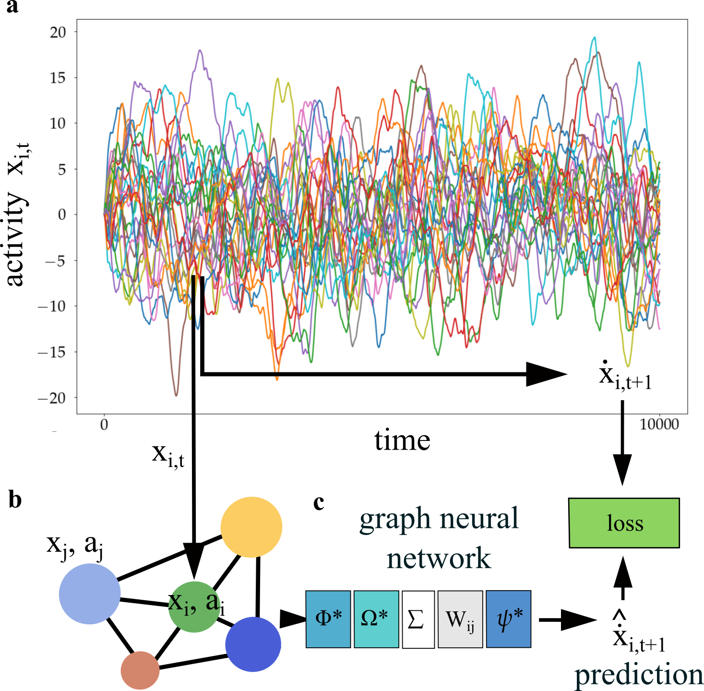

# NeuralGraph

Graph network modeling neural activities

<p align="center">
  
</p>
<p align="center">The temporal activity of a simulated neural network (a) is converted into densely connected graph (b) processed by a message passing GNN (c). Each neuron (node i) receives activity signals from connected neurons (node j), processed by a transfer function and weighted by the connection matrix. The sum of these messages is updated to obtain the predicted activity rate. In addition to the observed activity, the GNN has access to learnable latent a_i vectors associated with each node.</p>

### Setup

Create a conda environment based on your system architecture:

- MacOS:

```
conda env create -f envs/environment.mac.yaml
conda activate neural-graph-mac
```

- Linux: we are currently using the cuda 13 wheels, which requires that your
  system nvidia drivers are version >= 565.xx. Update the `--extra-index-url`
  to use the cuda 12.x wheels, e.g.,

```
--- a/envs/environment.linux.yaml
+++ b/envs/environment.linux.yaml
@@ -41,8 +41,8 @@ dependencies:
   - jupytext

   - pip:
-      # Get CUDA 13.0 wheels
-      - --extra-index-url https://download.pytorch.org/whl/cu130
+      # Get CUDA 12.9 wheels
+      - --extra-index-url https://download.pytorch.org/whl/cu129
       - torch==2.9
       - torchvision==0.24
       - torchaudio==2.9
```

and then

```
conda env create -f envs/environment.linux.yaml
conda activate neural-graph-linux
```

Install tiny-cuda-nn manually

```
pip install git+https://github.com/NVlabs/tiny-cuda-nn/#subdirectory=bindings/torch
```

Install the package by executing the following command from the root of this directory:

```
pip install -e .
```

Download the pretrained FlyVis models by running:

```
flyvis download-pretrained
```

Then, you should be able to import all the modules from the package in python:

```python
from NeuralGraph import *
```

The entry point for the code is to run `python GNN_Main.py` and there are
hard-coded references to paths in `/groups/saalfeld/...` throughout. See
[PR #13](https://github.com/saalfeldlab/NeuralGraph/pull/13) for one way to add
support for running the code on multiple machines.
