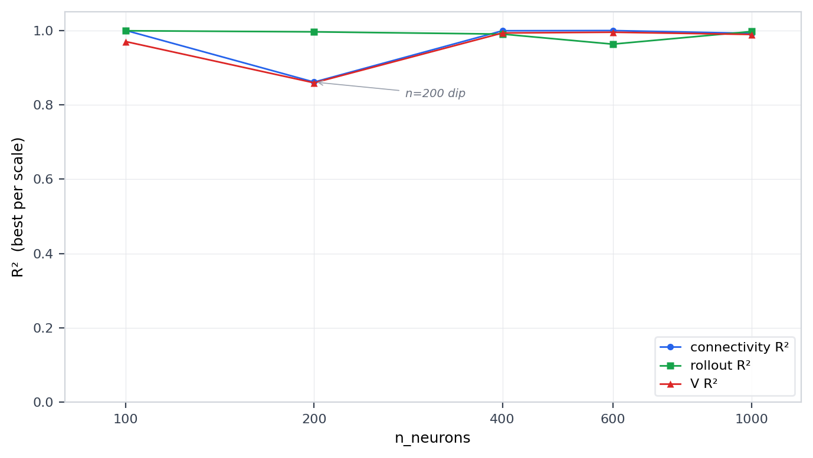

## Problem Statement

Low-rank connectivity (rank 20, n=100 neurons) produces neural activity with effective rank ~12 --- the hardest regime for connectivity recovery. With fewer distinguishable activity modes, many different connectivity matrices W can generate the same neuron traces. The GNN must discover the true W from severely under-determined data. The central question: **can we find GNN training parameters that reliably recover W from low-rank dynamics?**

## From Landscape to Dedicated Exploration

This case study builds upon the **348-iteration landscape exploration** ([Landscape Results](results.qmd)), which systematically mapped GNN training configurations across 29 regimes. Block 2 of that exploration devoted 12 iterations to the low-rank regime (n=100 neurons, rank=20, eff_rank~12). The LLM identified two critical levers --- **lr_W** and **L1** --- and systematically combined them to reach an optimal configuration at iteration 21:

| | lr_W | L1 | connectivity_R^2^ | rollout_R^2^ (1000 frames) |
|:---|:----:|:--:|:---------:|:---------:|
| Iter 13 (baseline) | 4E-3 | 1E-5 | 0.999 | 0.902 |
| Iter 18 (lower L1) | 4E-3 | 1E-6 | 1.000 | 0.925 |
| Iter 19 (lower lr_W) | 3E-3 | 1E-5 | 0.999 | 0.943 |
| **Iter 21 (both)** | **3E-3** | **1E-6** | **0.993** | **0.996** |

Overall convergence: 9/12 iterations (75%). Connectivity recovery was not the bottleneck --- nearly all iterations achieved connectivity_R^2^ > 0.99. The challenge was dynamics recovery (test_R^2^), highly sensitive to the lr_W/L1 combination. These results come from a single random seed and a single network size (n=100 neurons); the dedicated exploration below reveals that both the optimal configuration and recovery difficulty are seed-dependent.

### Established Principles (n=100 neurons, single seed)

::: {.callout-note}
### 1. L1=1E-6 is critical for low-rank dynamics
At L1=1E-5, connectivity converges (R^2^ > 0.99) but dynamics remain poor (test_R^2^ ~0.90). Reducing L1 to 1E-6 unlocks near-perfect dynamics (test_R^2^ = 0.996). Excessive L1 penalizes small W entries that encode the low-rank structure, forcing the MLP to compensate. The role of L1 here echoes the LASSO framework ([Tibshirani, 1996](https://doi.org/10.1111/j.2517-6161.1996.tb02080.x)): L1 regularization performs implicit variable selection, zeroing out irrelevant entries while preserving the signal. The key is calibration --- too much L1 destroys the low-rank structure, too little allows noise to persist.
:::

::: {.callout-note}
### 2. Full-matrix learning + L1 outperforms direct factorization
`low_rank_factorization=True` (W = W_L @ W_R) underperforms direct W learning. At lr_W=5E-3 factorization gives connectivity_R^2^=0.899 vs 0.999 without. The GNN recovers W structure better when learning a full N×N matrix and letting L1 induce the low-rank structure. This is a well-established principle: learning in an overparameterized space and regularizing is generally more effective than constraining to the true dimension from the start. For matrix recovery, [Candès & Recht (2009)](https://doi.org/10.1007/s10208-009-9045-5) and [Recht, Fazel & Parrilo (2010)](https://doi.org/10.1137/070697835) proved that minimizing the nuclear norm (the L1 analog for singular values) over the full matrix space provably recovers low-rank matrices, while the direct rank-constrained factorization W = W_L @ W_R introduces non-convex symmetries and saddle points ([Bhojanapalli, Neyshabur & Srebro, 2016](https://arxiv.org/abs/1605.07221)). The same principle underpins compressed sensing ([Candès, Romberg & Tao, 2006](https://doi.org/10.1002/cpa.20124); [Donoho, 2006](https://doi.org/10.1109/TIT.2006.871582)): solving in a higher-dimensional space with sparsity penalty recovers the true sparse solution more reliably than direct low-dimensional search.
:::

::: {.callout-note}
### 3. Optimal lr_W shifts downward (4E-3 → 3E-3)
Compared to chaotic baseline (lr_W=4E-3), the low-rank regime needs lower lr_W=3E-3. The lower effective rank provides less gradient signal, so smaller learning rate steps avoid overshooting.
:::

### Iter 21: rank=20, connectivity W = U V, n=100 neurons

### Simulated data

{.lightbox group="iter21"}

::: {layout-ncol=2}
{.lightbox group="iter21"}

{.lightbox group="iter21"}
:::

### Learned W, U, V

The GNN learns a full N×N connectivity matrix W during training. Since the true connectivity is low-rank (W = U V), we extract the learned low-rank factors by performing SVD on the learned W and retaining the top-*r* singular vectors. The resulting U_learned and V_learned are then aligned to the true U and V via Procrustes rotation (orthogonal alignment that minimizes the Frobenius distance), followed by a sign/permutation correction to resolve the inherent ambiguity in SVD factor ordering.

::: {.callout-warning}
### W initialization matters
The learned W matrix is initialized at the start of training. Three modes are available: `randn` (std=1), `randn_scaled` (std=scale/sqrt(N)), and `zeros`. Only **`randn`** produces successful recovery --- both `randn_scaled` and `zeros` fail to converge. Gradient clipping on W does not help as a rescue for failing initializations.
:::

{.lightbox group="iter21"}

{.lightbox group="iter21"}

### Dynamics prediction: one-step derivative

The GNN is trained to predict the first derivative of neural activity. At each timestep, we feed the **true** activity to the GNN and compare its predicted derivative to the ground-truth derivative. This isolates the per-step accuracy of the learned dynamics, independent of error accumulation.

{.lightbox group="iter21"}

### Dynamics prediction: 10,000 steps rollout

The rollout starts from the true initial activity at a single timepoint and then iterates the GNN forward autonomously --- each predicted state becomes the input for the next step. Errors accumulate over time, making this a much harder test than one-step prediction.
The GNN captures the population activity patterns correctly --- the vertical structure in the kinograph (which neurons are co-active) is well recovered. However, the temporal transitions between patterns are less accurate: the GNN gets the **patterns** right but not the precise **timing** of mode switching. Here U and V are both well recovered (R^2^≈0.97), yet the rollout still drifts. A direct-dynamics experiment (bypassing the GNN, running the true RNN equation du/dt = −u + 7·W·tanh(u) with different W matrices; montages not shown, see `run_hybrid_UV_rollout.py`) shows that even supplying the ground-truth V while keeping the learned U gives only rollout R^2^=0.67 at 600 frames, and supplying the ground-truth U with the learned V gives R^2^=0.77. Neither factor alone at R^2^≈0.97 is sufficient --- the chaotic dynamics amplify any residual error in either factor exponentially through the recurrent loop. Only the exact ground-truth W produces a perfect rollout.

{.lightbox group="iter21"}

#### Mode analysis

To understand the rollout drift, we project both GT and predicted kinographs onto the true U basis (the top-20 SVD modes of W). If the GNN has learned the correct spatial modes, both projections should activate the same mode set --- the question is whether the temporal activation sequence matches.

{.lightbox group="iter21"}

The mode power scatter (bottom-right) plots the mean squared amplitude of each mode in GT vs prediction: the slope of 1 confirms that GT and predicted rollouts distribute power identically across all 20 modes --- the GNN activates each mode with the correct strength. However, per-mode temporal correlation (bottom-left) averages only r=0.32, meaning the *temporal sequence* of mode activation diverges. The cross-neuron correlation per frame (top-right) oscillates between +1 and --1: GT and predicted patterns periodically align, then anti-align as the chaotic dynamics push the two trajectories out of phase. This is **temporal phase drift** --- the rollout visits the same attractor but at progressively different times, until the two trajectories are decorrelated.

---

## Dedicated Exploration

The dedicated exploration fixed the simulation (low_rank, rank=20, 10k frames) and searched training hyperparameters using UCB tree search with 4 parallel slots per batch. The exploration addresses two questions in sequence: **how sensitive is recovery to the training seed** (at fixed n=100 neurons), and **how does recovery scale with network size** (n=100 to n=1000).

At n=100, connectivity recovery (connectivity_R^2^) is essentially solved --- nearly all iterations achieve connectivity_R^2^ > 0.999 regardless of hyperparameters. The real challenge is **dynamics recovery (rollout_R^2^)**, which is highly sensitive to the training seed and the lr_W/L1 combination.

### Influence of the Training Seed

The training seed controls only the GNN's random initialization --- the simulated data (W, U, V, activity) is identical across all seeds. Yet it is the single most important factor for dynamics recovery. Across 70 seeds at n=100: **49 learnable (70%), 21 hard (30%)**. All 21 hard seeds share the same failure signature: U recovers well (U_R^2^ ~0.95) while V is stuck (V_R^2^ < 0.43). The failure is **always asymmetric** --- no seed produces both bad U and bad V. This holds across extensive rescue attempts: seed=9000, tested across 6 hyperparameter configurations (lr_W=3--5E-3, L1=1E-5/1E-6, n_epochs=2--3), consistently gives U_R^2^=0.948, V_R^2^=0.44; seed=1000, tested 15 times, gives U_R^2^=0.946, V_R^2^=0.427. The asymmetry is consistent with [Mastrogiuseppe & Ostojic (2018)](https://arxiv.org/abs/1711.09672): in low-rank networks, the right-connectivity vectors (our U columns) determine the **output pattern** of activity and are directly constrained by the observed dynamics, while the left-connectivity vectors (our V rows) implement **input selection** --- an implicit filtering operation that is less directly observable.

{.lightbox group="iter069"}

{.lightbox group="iter069"}

Despite poor W recovery, the one-step derivative prediction remains decent (R^2^=0.964, SSIM=0.920) --- the GNN learns enough local structure to approximate per-step dynamics. But this accuracy does not survive autonomous rollout: the rollout diverges catastrophically (R^2^=-inf, values reach 10^33^). As the hybrid U/V experiment above demonstrates, even perfect knowledge of one factor is not enough --- errors in either U or V are amplified exponentially through the chaotic recurrent loop. Here, with V_R^2^=0.43, the errors are far too large for the recurrent dynamics to remain stable.

{.lightbox group="iter069"}

{.lightbox group="iter069"}

---

## Influence of Number of Neurons

The exploration then shifted from seed sensitivity to network scaling: how does recovery change as n_neurons grows from 100 to 1000? Five scales were tested (n=100, 200, 400, 600, 1000), all at rank=20, with n_frames=100,000 and data_augmentation_loop=50 for scales above 100.

{.lightbox}

**n=200 is the hardest scale.** At n=200, connectivity_R^2^ drops to 0.86, V_R^2^ to 0.86, and the hard-seed rate rises from 30% (n=100) to 40.5%. Several seeds that were top-tier at n=100 flip to hard at n=200 (seeds 137, 1000, 6000, 17000, 20000, 21000), while some mid-tier seeds improve (seeds 7000, 11000). The V-recovery failure at n=200 is also more severe: V_R^2^ as low as 0.07--0.21 (vs 0.38--0.43 at n=100).

**From n=400 onward, W-recovery improves monotonically** (connectivity_R^2^: 0.999 at n=400, 0.9995 at n=600). At larger n, each row of W is more constrained by the data and the GNN is forced toward the true connectivity. However, dynamics recovery is non-monotonic: rollout_R^2^ dips at n=400/600 despite near-perfect W. This is a "reverse pattern" --- the GNN learns the correct W structure but the MLP has not co-adapted --- solved by adjusting lr_W per scale (n=400 needs lr_W=6E-3, n=600 needs 4--5E-3).

**n=1000 is the sweet spot**: both connectivity_R^2^=0.992 and rollout_R^2^=0.997 are excellent with the standard recipe in a single iteration, making it the easiest scale for low-rank recovery.

