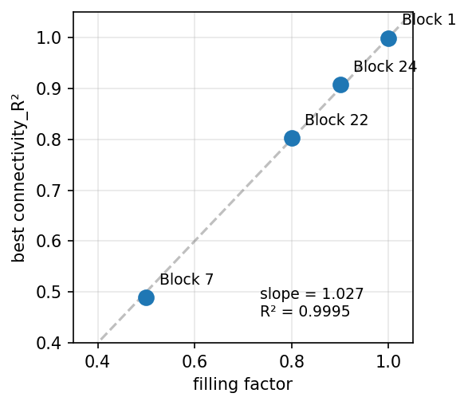

## Problem Statement

Sparse connectivity (50% filling factor, 100 neurons) produces neural activity with subcritical spectral radius (rho=0.746) --- the regime where connectivity recovery hits a fundamental wall. The central question: **is the connectivity_R^2^ ceiling a training problem or an identifiability limit?**

## From Landscape to Dedicated Exploration

This case study builds upon the **348-iteration landscape exploration** ([Landscape Results](results.qmd)), which mapped GNN training configurations across 29 neural activity regimes at 100 neurons with a single neuron type. Three blocks (7, 8, 17) devoted 36 iterations to the sparse regime: all configurations gave connectivity_R^2^ ~0.489 at 10k frames; adding noise inflated activity rank from 21 to 91 but had no effect (connectivity_R^2^ = 0.490); tripling the frame count to 30k made it worse (activity rank dropped from 21 to 13, connectivity_R^2^ = 0.436). The landscape also tested partial connectivity at fill=80% and 90%, revealing an almost exact linear law: connectivity_R^2^ $\approx$ filling_factor (slope=1.027, R²=0.9995). The dedicated exploration then proceeded in three phases: **code modifications** (blocks 1--6, 72 iterations at 100 neurons), **scaling to 200 neurons** (blocks 7--8, 40 iterations), and **network scaling** (blocks 9--10, 20 iterations from 200 to 1000 neurons). The answer: the ceiling shifts to **~0.50** and is **universal across all network sizes** --- a fundamental identifiability limit of the model form at sparse, subcritical connectivity.

{.lightbox width=50%}

### Sparse 50%, 100 neurons

### Simulated data

{.lightbox group="iter73"}

::: {layout-ncol=2}
{.lightbox group="iter73"}

{.lightbox group="iter73"}
:::

The eigenvalue spectrum reveals the root cause. The spectral radius of W --- its largest eigenvalue magnitude --- determines whether perturbations propagate or decay through the network. When rho > 1 (supercritical), signals amplify as they travel through the recurrent loop: each neuron's activity carries an imprint of its full connectivity neighbourhood, giving the GNN rich information to recover W. When rho < 1 (subcritical), signals decay exponentially with each step: neuron i's activity is dominated by its own local dynamics rather than its connections, and many different W matrices produce indistinguishable traces.

For comparison, the fully connected chaotic baseline has rho = 1.035 (supercritical) and achieves connectivity_R^2^ = 0.999. Sparse 50% filling reduces the spectral radius to 0.746 --- well below the critical threshold. All eigenvalues lie inside the unit circle, and connectivity recovery plateaus at ~0.48.

{.lightbox group="iter73"}

### Learned W

The GNN achieves near-perfect one-step derivative prediction (R^2^=0.999, SSIM=0.999) yet recovers only 48% of the true connectivity. This is a clear case of **degeneracy**: the model finds an alternative solution that predicts dynamics correctly at each step without recovering the true W.

::: {layout-ncol=2}

{.lightbox group="iter73"}

{.lightbox group="iter73"}

:::

### **Dynamics prediction: one-step derivative**

{.lightbox group="iter73"}

### **Dynamics prediction: 10,000 steps rollout**

Despite excellent one-step accuracy, the rollout remains reasonable (R^2^=0.869, SSIM=0.823) --- the subcritical spectral radius actually helps here, as the contractive dynamics prevent error amplification. The wrong W produces visually similar trajectories because rho < 1 damps perturbations at each step, masking the connectivity error.

{.lightbox group="iter73"}

### **Mode analysis**

To understand what the GNN captures despite poor connectivity recovery, we project both GT and predicted rollout onto the top-21 SVD modes of the true W (matching the activity rank at 99% variance). Unlike the low-rank case where W has exactly 20 modes capturing 100% of variance, the sparse W is full-rank --- the top 21 modes explain only 56.6% of W's variance, and the singular values are nearly uniform (1.37, 1.35, 1.33...) with no dominant modes.

{.lightbox group="iter73"}

The results reveal a sharp contrast with the low-rank case. The GNN recovers the *temporal dynamics* along most modes remarkably well (mean temporal r = 0.880, vs 0.324 for low-rank), and the cross-neuron spatial correlation is high (mean = 0.937). Mode power tracks GT closely (energy ratio = 0.927). This reinforces the degeneracy interpretation: the GNN correctly captures *how* the network evolves in time but cannot recover *which connections* produce that evolution --- the mapping from W entries to mode dynamics is many-to-one at subcritical rho.

---

## Dedicated Exploration: 100 Neurons (Blocks 1--6, 72 iterations)

The dedicated exploration systematically tested every available lever to break the 0.489 ceiling. None succeeded.

### Parameter sweep: complete insensitivity

The first 12 iterations swept all training parameters across wide ranges. The result was universal: connectivity_R^2^ = 0.489 regardless of configuration.

| Parameter | Range tested | Effect on connectivity_R^2^ |
|:---|:---|:---:|
| L1 regularization | 1E-6 to 1E-2 (4 orders of magnitude) | None |
| lr_W | 2E-3 to 5E-3 | None |
| n_epochs | 2, 6, 12 | None |
| batch_size | 8, 16 | None |
| seed | 42, 137, 256 | None |

All configurations produced connectivity_R^2^ = 0.489 ± 0.001 with test_pearson = 0.999 --- the same ceiling, the same degeneracy.

### Code modifications: 10 interventions, same ceiling

The LLM then shifted from parameter tuning to architectural interventions, modifying the GNN source code across 6 blocks:

| Block | Intervention | connectivity_R^2^ | Outcome |
|:---:|:---|:---:|:---|
| 1--3 | L1 scheduling, proximal gradient, two-phase training | 0.489 | No effect |
| 4 | W gradient clipping, edge_diff penalty scaling | 0.489 | No effect |
| 5 | **Replace MLP with fixed tanh** (`lin_edge_mode='tanh'`) | **0.489** | **Paradigm shift** |
| 5 | Replace MLP with identity (`lin_edge_mode='identity'`) | 0.009 | Catastrophic failure |
| 6 | coeff_lin_phi_zero (penalize phi at rest), W_optimizer=sgd | 0.489 | No effect |

::: {.callout-note}
### The tanh experiment proves identifiability

The paradigm shift came at iteration 45: replacing the learnable edge MLP with the fixed true nonlinearity tanh(x). This eliminates all MLP compensation --- the model can no longer hide a wrong W behind a steeper transfer function. Result: connectivity_R^2^ = 0.489, **unchanged**. Dynamics prediction collapses (test_pearson: 0.999 → 0.423) because the MLP can no longer compensate, but the W recovery is identical. The 0.489 ceiling is intrinsic to the information content of the observed dynamics at rho = 0.746, not an artifact of the architecture.
:::

---

## Claude Discussion: The Identity Law connectivity_R^2^ $\approx$ filling_factor

The landscape exploration uncovered a striking empirical relationship: connectivity_R^2^ scales almost exactly as the filling factor of the connectivity matrix (slope = 1.027, R² = 0.9995 across fill = 50%, 80%, 90%, 100%).

### Theoretical interpretation

The identity law admits a simple explanation rooted in the structure of the inverse problem and the R² metric. The dynamics are $\dot{x}_i = -x_i + \sum_j W_{ij}\,\phi(x_j)$, where the diagonal of W is zero (no self-connections) and the leak term $-x_i$ provides intrinsic decay. The connectivity matrix W has $n^2$ entries, of which a fraction $f$ (the filling factor) are nonzero.

W is a real non-symmetric matrix ($W_{ij} \neq W_{ji}$ in general), so its eigenvalues are complex, coming in conjugate pairs $\lambda = a \pm bi$. The real part $a$ controls exponential growth or decay of each mode; the imaginary part $b$ controls oscillation frequency (rotation in state space). For random matrices, the circular law (Girko) predicts eigenvalues distribute uniformly inside a disk of radius $\sigma\sqrt{n}$ in the complex plane. The spectral radius $\rho = \max|\lambda| = \max\sqrt{a^2 + b^2}$ determines the system's stability: when $\rho < 1$, all modes decay and the network is contractive.

When $\rho < 1$, a perturbation propagated through the recurrent loop is multiplied by $W$ at each discrete time step. After $k$ steps, its amplitude scales as $\|W^k\| \sim \rho^k$ --- exponential decay. At $\rho = 0.746$, a signal retains only $0.746^5 \approx 23\%$ of its amplitude after 5 steps, and $0.746^{10} \approx 5\%$ after 10 steps. This means each neuron's activity is shaped primarily by its direct inputs (one-step neighbours) rather than by indirect multi-step paths through the network. The information about W encoded in the observed traces is therefore limited to first-order correlations, which are insufficient to uniquely determine all nonzero entries.

The GNN can still identify which entries of W are *structurally present* --- even weak contributions from $W_{ij}\,\phi(x_j)$ leave a gradient signal during training. But the *magnitude* of each nonzero entry is poorly constrained because $\rho < 1$ suppresses the multi-step reverberations that would otherwise disambiguate similar connectivity patterns. The zero entries, by contrast, are trivially identified: they contribute nothing to any neuron's dynamics.

This partitions the $n^2$ entries into two classes:

- **Zero entries** (fraction $1 - f$): perfectly recovered (true zeros map to learned zeros), contributing 0 error.
- **Nonzero entries** (fraction $f$): partially recovered with a connectivity_R^2^ that reflects the residual ambiguity at the given $\rho$.

The R² metric is computed over all $n^2$ entries. The zero entries (fraction $1-f$) are recovered almost exactly, contributing near-zero residual and near-zero variance. The nonzero entries (fraction $f$) carry almost all the variance of the true W and accumulate almost all the prediction error. The overall R² is thus dominated by the nonzero-entry R², weighted by their share of total variance --- which is approximately $f$. If the per-entry recovery quality on nonzero entries is roughly constant across filling factors (plausible when all regimes are subcritical), then connectivity_R^2^ $\approx$ $f$. The near-unit slope (1.027) implies the GNN recovers the *support* of W (which entries are nonzero) almost perfectly, while the *values* of nonzero entries carry most of the residual error.

### Relation to existing literature

The connection between sparsity and network identifiability has been studied from several angles, though none report the specific identity law observed here:

- **Hayden et al.** (Automatica, 2016) frame sparse network identification as a compressed sensing problem, showing that identifiability depends on network structure and measurement design --- but they analyze conditions for *exact* recovery rather than quantifying how R^2^ degrades with density.
- **Materassi & Salapaka** (SIAM J. Appl. Dyn. Syst., 2017) recover network topology from sparse spectral measurements, linking spectral properties to identifiability --- but do not study the filling factor as a continuous variable.
- **Fousek et al.** (Frontiers in Neural Circuits, 2025) show that sparse connectivity alters neural representations and information flow --- but study task performance rather than connectivity recovery.

The identity law connectivity_R^2^ $\approx$ filling_factor appears to be a novel empirical. It suggests that at subcritical spectral radius, the fundamental limit on connectivity recovery is set by the fraction of the matrix that carries recoverable signal --- a geometric rather than dynamical constraint.
