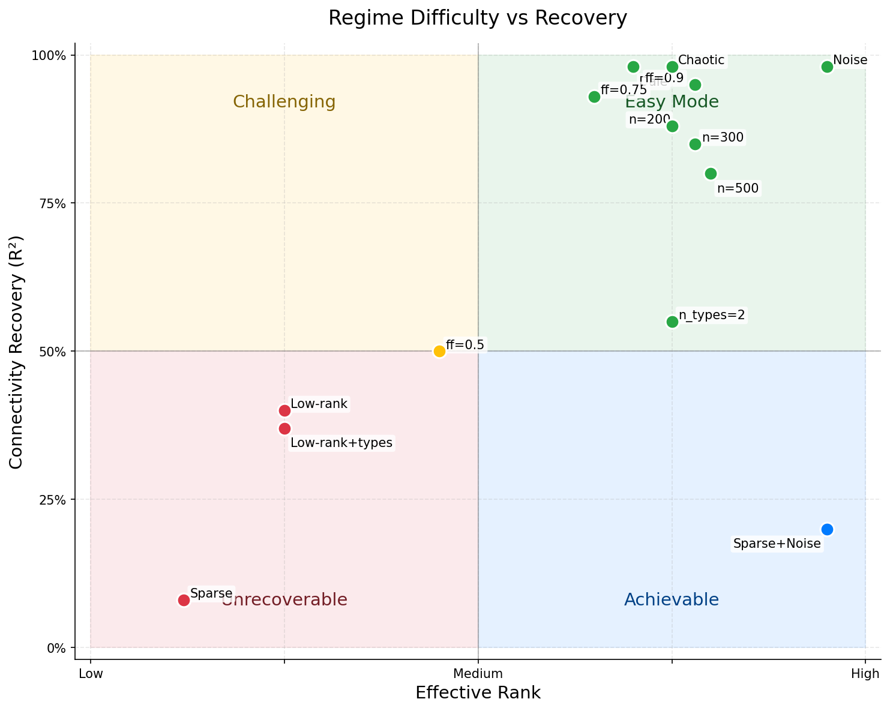
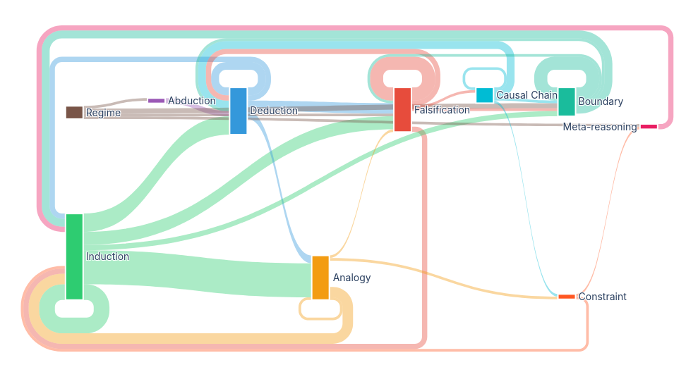

## Introduction

We previously showed that graph neural networks can recover circuit structure and signaling functions of neural assemblies from activity data alone. However, this inverse problem is known to be ill-posed under certain conditions. For instance, when neural activity is low-rank, many different circuits can generate the same neuron traces. It remains an open question whether graph neural networks can recover connectivity in general, or only for specific classes of neural assemblies.

To address this question, we extend our graph neural network framework with a large language model. In this new setup, the role of the graph neural network framework is to perform experiments and deliver quantified results. The role of the large language model is to interpret, compare and finally compress the experiment results into structured memory. On the basis thereof, the large language model is next prompted to mutate selectively the neural dynamics configuration and/or the graph neural network training scheme.

We show that these sequential interactions between experimentation, large language model and long-term memory, lead progressively to a scientific tool. Testable hypotheses are drawn, repeatable experiments are conducted to validate or falsify them, and ultimately causal understanding emerges. Importantly, the **closed-loop scientific reasoning results from the interactions between the three components** rather than residing solely within the large language model.
the closed-loop system embodies a Lakatosian mode of inquiry, in which understanding emerges from structured interaction between a stable modeling core and systematically revised experimental assumptions.

Using this framework, we systematically explored a broad space of neural assembly regimes, including chaotic, low-rank, sparse, and constrained (e.g. Dale-law) dynamics, while varying data richness, network size, and training conditions. Rather than optimizing for a single best-performing model, the closed-loop system evaluates entire families of experimental outcomes, tracking both successes and systematic failures across conditions. This allows the framework to distinguish failures arising from insufficient optimization from those reflecting fundamental identifiability limits of the inverse problem.


---

## The Exploration Loop

```{mermaid}
%%| fig-width: 6
flowchart LR
    A[Experiment] --> B[LLM]
    B --> A

    B --> C[(Memory)]
    C --> B

    style A fill:#e1f5fe
    style B fill:#fff3e0
    style C fill:#f3e5f5
```

The framework implements a **closed-loop exploration engine** composed of three interacting components:

1. **Experiment**
   A physics-based simulator generates neural activity. A message-passing GNN learns to predict activity derivatives while jointly recovering the connectivity matrix W. **4 parallel slots** run simultaneously per batch via UCB tree search.

2. **LLM**
   The LLM interprets results in context of accumulated memory, performs scientific operations (identify regimes, detect convergence, generate hypotheses), and selects the next intervention via UCB tree search.

3. **Memory**
   Observations, failed attempts, and validated principles are written into explicit long-term memory. This memory persists across experimental blocks, enabling cumulative understanding rather than episodic trial-and-error.

---

## [Results](results.qmd)

The exploration maps connectivity recovery across 30 regimes (360 iterations) and identifies three qualitatively distinct recovery modes:

- **Robust recovery** --- dense chaotic networks (100--1000 neurons) converge reliably when given sufficient data. The dominant lever is the number of frames: 30k frames solves 300 and 600 neurons (0%-->100% convergence); 100k frames solves 1000 neurons (connectivity_R^2^=1.000, 12/12 converged).
- **Instance-dependent recovery** --- low-rank connectivity (rank=20) is solvable in principle (connectivity_R^2^>0.999) but 30% of training seeds fail due to asymmetric factor recovery (good U, bad V), requiring per-seed hyperparameter tuning.
- **Structural limits** --- three regimes hit ceilings that no amount of data, training, or code modification can break: subcritical spectral radius (sparse 50%, connectivity_R^2^~0.50 universal from 100 to 1000 neurons), partial connectivity (connectivity ceiling $\approx$ filling_factor, confirmed at 50/80/90/100%), and fixed-point collapse (g=1, activity rank drops from 5 to 1 as the number of frames increases).

[{.lightbox}](results.qmd)

---

## [Epistemics](epistemic-analysis.qmd)

400+ reasoning events classified across 348 iterations and 29 blocks into ten formal epistemic modes (induction, deduction, falsification, analogy, boundary probing, etc.), connected by 150+ causal edges. The system achieves 74% deduction accuracy (well above chance), 70% cross-regime analogy transfer success, and 100% falsification-to-refinement rate. ~90 principles established with confidence 45--100%.

Six distinct reasoning phases emerge: (1) boundary probing and induction dominate early as the system maps each new regime, (2) deduction and analogy grow as accumulated principles enable cross-regime predictions, (3) falsification and constraint recognition widen when structurally hard regimes are encountered, (4) analogy drives scaling explorations as frame-count dominance overturns multiple principles (blocks 15--16), (5) constraint recognition peaks as the system maps structural limits --- subcritical spectral radius (block 17), connectivity ceiling at filling_factor (blocks 22--24) --- while confirming that gain is a solvable difficulty axis (blocks 19--21), and (6) regime recognition identifies the gain--activity rank critical transition (blocks 25--28), identifying fixed-point collapse (g=1) as a new unsolvable axis and inverse lr_W at g=2.

[{.lightbox}](epistemic-analysis.qmd)

---

## [Exploration](exploration-gallery.qmd)

UCB tree search guides the exploration across 348 iterations and 29 blocks, processing 4 parallel slots per batch. At each step, the LLM selects parent configurations to mutate using an Upper Confidence Bound strategy that balances exploitation of high-performing branches with exploration of under-visited regions. The tree grows through 29 regime blocks --- from chaotic baselines (100 neurons) through sparse connectivity, scale challenges (200, 300, 600, 1000 neurons), heterogeneous networks, recurrent training, frame-count scaling experiments, gain reduction (g=1--3), and partial connectivity (fill=80--90%).

Each iteration produces a connectivity scatter plot, kinograph (dynamics visualization), and MLP embedding analysis. The UCB tree snapshots show how the search progressively narrows: early blocks fan out widely as the system maps parameter boundaries, middle blocks concentrate on promising subtrees while pruning failed branches, and late blocks show rapid convergence as frame-count dominance reduces the effective search dimension. Blocks 17--23 show flat UCB landscapes when structural limits dominate (sparse, fill<100%) versus rapid convergence when more frames rescues a regime (g=3, 200 neurons). Blocks 24--28 reveal the gain--activity rank critical transition: g=1 produces flat landscapes (no parameter matters), while g=2 shows a narrow ridge requiring inverse lr_W.

[{.lightbox}](exploration-gallery.qmd)

---

## Case Studies

### [Low-Rank Connectivity](case-low-rank.qmd)

Low-rank connectivity (rank=20, activity rank ~12) is the hardest recoverable regime: connectivity_R^2^>0.999 is achievable but 30% of training seeds fail with asymmetric U/V recovery. A 340-iteration dedicated exploration established a universal recipe template and mapped recovery across network scales (100 to 1000 neurons). A gain x rank sweep is now exploring how coupling strength and matrix rank jointly affect learnability.

### [Sparse Connectivity](case-sparse.qmd)

Sparse connectivity (50% filling, rho=0.746) hits a fundamental identifiability ceiling at connectivity_R^2^~0.50 that persists across 112 iterations, 10 code modifications, 3 seeds, and network sizes from 100 to 1000 neurons. The paradigm shift: replacing the MLP with fixed tanh gives identical connectivity_R^2^=0.489, proving the ceiling is an intrinsic limit of the model form, not an architectural degeneracy.

---

## References

1. Stern, M., et al. (2023). Graph neural networks uncover structure and function underlying the activity of neural assemblies.

2. Romera-Paredes, B., et al. (2024). Mathematical discoveries from program search with large language models. *Nature*.

3. Novikov, A., et al. (2025). AlphaEvolve: A coding agent for scientific and algorithmic exploration.
