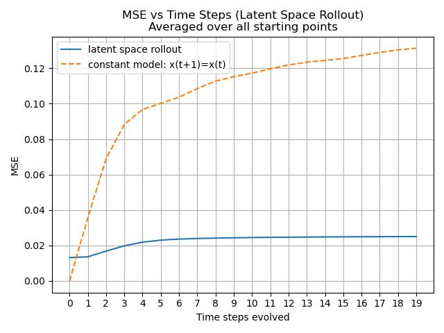

# Table of Contents

- [Introduction and summary](#introduction-and-summary)
- [Activity space vs latent space roll out](#activity-space-vs-latent-space-roll-out)
  - [verify checkpoint stability](#verify-checkpoint-stability)
  - [network structure perturbations](#network-structure-perturbations)
  - [role of noise in training](#role-of-noise-in-training)
- [Experiments to improve voltage baseline](#experiments-to-improve-voltage-baseline)
  - [Reduce network size](#reduce-network-size)
  - [Change activation](#change-activation)
  - [add regularization](#add-regularization)
- [History of experiments prior to checkpoint](#history-of-experiments-prior-to-checkpoint)
  - [Baseline experiment](#baseline-experiment)
  - [Performance benchmark experiments](#performance-benchmark-experiments)
  - [Assess variance in training](#assess-variance-in-training)
  - [Assess impact of normalization](#assess-impact-of-normalization)
  - [Sweep batch size and learning rate with batch norm turned off](#sweep-batch-size-and-learning-rate-with-batch-norm-turned-off)
  - [Make latent dim 1](#make-latent-dim-1)
  - [Add the stimulus](#add-the-stimulus)
  - [Add regularization loss](#add-regularization-loss)
  - [Regularize all modules](#regularize-all-modules)
  - [Note on interesting structure in the jacobian](#note-on-interesting-structure-in-the-jacobian)
  - [Checkpoint models](#checkpoint-models)
  - [Rerun with no regularization](#rerun-with-no-regularization)
  - [Sweep batch size without regularization.](#sweep-batch-size-without-regularization)
  - [Try huber/mse, gelu/relu, addition of matrix](#try-hubermse-gelurelu-addition-of-matrix)
  - [Add linear skip connections to encoder/decoder](#add-linear-skip-connections-to-encoderdecoder)
  - [How many hidden](#how-many-hidden)
- [baseline](#baseline)
- [input skips with varying numbers of hidden layers](#input-skips-with-varying-numbers-of-hidden-layers)
  - [Noise vs no noise](#noise-vs-no-noise)
  - [switch to mlp(x, Ax)?](#switch-to-mlpx-ax)

# Introduction and summary

We have a working latent space model for FlyVis voltage.

```
                  LatentModel Architecture
                  ========================

  Input at time t:
  ┌─────────────────┐                    ┌─────────────────┐
  │  Neural State   │                    │    Stimulus     │
  │      x(t)       │                    │    stim(t)      │
  └────────┬────────┘                    └────────┬────────┘
           │                                      │
           │                                      │
           ▼                                      ▼
  ┌─────────────────┐                    ┌─────────────────┐
  │    Encoder      │                    │    Stimulus     │
  │   (MLPSkips)    │                    │    Encoder      │
  │ neurons→latent  │                    │   (MLPSkips)    │
  └────────┬────────┘                    └────────┬────────┘
           │                                      │
           │                                      │
           ▼                                      ▼
    ┌──────────────┐                      ┌──────────────┐
    │   proj(t)    │                      │ proj_stim(t) │
    │ (latent_dims)│                      │ (stim_dims)  │
    └──────┬───────┘                      └──────┬───────┘
           │                                      │
           └──────────────┬───────────────────────┘
                          │
                     concatenate
                          │
                          ▼
                  ┌───────────────┐
                  │    Evolver    │
                  │   (MLPSkips)  │
                  │ latent evolve │
                  └───────┬───────┘
                          │
                          ▼
                  ┌───────────────┐
                  │  proj(t+Δt)   │
                  │ + proj_stim   │
                  └───────┬───────┘
                          │
                     split off
                    stimulus part
                          │
                          ▼
                  ┌───────────────┐
                  │    Decoder    │
                  │   (MLPSkips)  │
                  │ latent→neurons│
                  └───────┬───────┘
                          │
                          ▼
                  ┌───────────────┐
                  │    x(t+Δt)    │
                  │   (neurons)   │
                  └───────────────┘

```

The model has four main components:

- Encoder (MLPSkips): Maps neural activity x(t) → latent space
- Stimulus Encoder (MLPSkips): Maps raw stimulus → latent stimulus representation
- Evolver (MLPSkips): Evolves concatenated [latent state, latent stimulus] forward in time
- Decoder (MLPSkips): Maps evolved latent state → predicted neural activity x(t+Δt)

The model so far works for Voltage data with resolution Δt=20ms.

The results are based on the experiment `checkpoint_20251118`.

The model is trained on two losses - both measured using MSE.

- reconstruction loss: encoder/decoder can translate activity reliably to/fro latent space.
- evolution loss: one-step time evolution is accurate

Training data split:

```yaml
# ...
data_split:
  train_start: 4000 # Exclude burn-in
  train_end: 34000
  validation_start: 40000
  validation_end: 50000
  test_start: 54000
  test_end: 64000
```

The training is done on time points `fly_N9_62_1[4_000, 34_000)` (noise of 0.05).
The figures below are based on a separate `fly_N9_62_0[40_000, 50_000)` (no noise).

<table>
  <tr>
    <td></td>
    <td></td>
  </tr>
  <tr>
    <td align="center">MSE (mean squared error) for a rollout from an initial time point in activity space</td>
    <td align="center">MSE (mean squared error) for a rollout from an initial time point in latent space</td>
  </tr>
</table>

# Activity space vs latent space roll out

We observe that roll outs are stable in activity space even when they are unstable in
latent space. We need to understand the cause. Somehow going through the decoder-encoder
loop is pushing the trajectory back to a valid conformation. We've seen this happen in two
scenarios:

- changing the evolver to a classic MLP without skips
- changing the num hidden units in the encoder & decoder, which drastically
  reduces the number of parameters because the skip connections involve matrices
  with num neurons x num hidden units parameters.

| Scenario                                                | Activity Stable? | Latent Stable? | Notes                                                      |
| ------------------------------------------------------- | :--------------: | :------------: | ---------------------------------------------------------- |
| Baseline: checkpoint_20251118 + randomized seeds        |       Yes        |      Yes       | Val loss ~0.014, stable rollouts in both spaces            |
| Encoder/decoder hidden=64d/128d (latent=256d)           |       Yes        |       No       | Val loss ~0.015, latent rollout explodes after a few steps |
| Same as above, train no noise                           |       Yes        |       No       | Training with/without noise doesn't make a difference      |
| Latent dim=32d (Encoder/decoder hidden=256d)            |        No        |       No       | Quick explosion                                            |
| Latent dim=64d (Encoder/decoder hidden=256d)            |        No        |   Yes, worse   | Activity explodes, but later than 32d                      |
| Latent dim=128d (Encoder/decoder hidden=256d)           |    Yes, worse    |   Yes, worse   | All stable, but perhaps MSE is a little worse              |
| Sigmoid activation (various depths, otherwise baseline) |       Yes        |      Yes       | No impact from activation change - shows generality        |
| Evolver: mlp(x, Ax) 1/2/3 deep                          |    Yes, worse    | Yes, 10x worse | Mentioned as causing latent space instability              |

## verify checkpoint stability

Before we make up stories about latent space dimension vs encoder/decoder complexity, let's
check that the checkpoint we've arrived at is actually stable.

```bash

for seed in 1 12 123 1234 12345 ; do \
    bsub -J "seed${seed}" -n 1 -gpu "num=1" -q gpu_a100 -o seed${seed}.log python \
        src/LatentEvolution/latent.py checkpoint_20251118_stability \
        --training.seed $seed
done
```

Results:

- loss and mses are very reproducible to randomization of initial conditions

## network structure perturbations

Review the [experiments that reduce network size](#reduce-network-size).

Exclude the latent dim 32 for a moment.

- even when the latent space is shrunk to 64d, both roll outs remain stable.
- but, when the encoder/decoder hidden dimensions are reduced - even to 128d, we see an explosion
  in the latent space roll out. So the encoder/decoder is really a very critical piece here.
- TODO: finish this

## role of noise in training

I suspect this could be due to training with noise. We know from
that going to 128 dims causes the
rollout in latent space to explode.

If we trained without noise would it explode in both
spaces? And we will cross-validate with the noisy data. This will also test the 256d baseline
model.

```bash
for ldim in 64 128 256; do \
  bsub -J "noise${ldim}" -n 1 -gpu "num=1" -q gpu_a100 -o noise${ldim}.log python \
    src/LatentEvolution/latent.py no_noise_latent_roll_out \
    --encoder-params.num-hidden-units $ldim \
    --decoder-params.num-hidden-units $ldim \
    --training.simulation-config fly_N9_62_0_calcium \
    --cross-validation-configs.0.simulation-config fly_N9_62_1_calcium
done
```

Results:

- noise doesn't make a difference. We see the same results as in the encoder/decoder hidden
  units experiment: latent roll out blows up at 64, 128. activity rollout is stable.
  - this conclusion holds in cross-validation with noise (incorrectly labeled no noise)
  - it also holds on the noiseless validation data

# Experiments to improve voltage baseline

We have a working baseline now. The goal now is to make the models as small as possible
while maintaining performance.

## Reduce network size

### reduce encoder/decoder hidden units

The size of the encoder/decoder hidden units drives the parameter count. See if we can reduce that.

```bash
for ldim in 64 128 256; do \
  bsub -J "ldim${ldim}" -n 1 -gpu "num=1" -q gpu_a100 -o ldim${ldim}.log python \
    src/LatentEvolution/latent.py encoder_decoder_hidden_units \
    --encoder-params.num-hidden-units $ldim \
    --decoder-params.num-hidden-units $ldim
done
```

Results:

- val loss degrades: 64d ~ 0.019, 128d ~ 0.015, 256d (baseline) ~ 0.014
- activity space roll out is stable
- latent space roll out blows up after a few steps at 64 & 128, but is stable
  at 256.

Note that the latent space dimension was kept at 256d in the above experiment. Now, let's
change the latent space dimension, while keeping the hidden unit size constant. So this will
not significantly change the parameter count, but will limit the capacity of the evolver to
learn dynamics.

### reduce latent dimension

Let's keep the encoder/decoder hidden units fixed at 256. And then let's drop the
latent dimension.

```bash
for ldim in 32 64 128 256; do \
  bsub -J "ldim${ldim}" -n 1 -gpu "num=1" -q gpu_a100 -o ldim${ldim}.log python \
    src/LatentEvolution/latent.py latent_dim_reduce \
    --latent-dims $ldim
done
```

Results:

- we see a fairly large change in the validation loss when you drop the latent dimension
- Roll out:
  - latent roll out: remains bounded even at 64d. But the MSE is worse than with 256d. At 32d it
    explodes. At 256d worst case mean MSE in long roll out is ~ 2e-2, and at 64d we are at 4e-2.
  - activity roll out: explodes at 64d => going from the latent -> activity -> latent now is adding
    noise, which doesn't happen at 256d.

## Change activation

Note that the flyvis simulation data used a ReLU activation. It could be that our architecture
somehow secretly encodes the simulation. So fix the activation to `sigmoid` and iterate on
the architecture to get it to work.

```bash
for n in 1 2 3 ; do
  bsub -J "sigmoid${n}" -n 1 -gpu "num=1" -q gpu_a100 -o sigmoid${n}.log python \
    src/LatentEvolution/latent.py sigmoid0 \
      --activation Sigmoid \
      --encoder-params.num-hidden-layers $n \
      --decoder-params.num-hidden-layers $n \
      --evolver-params.num-hidden-layers $n
done
```

Results:

- changing the activation function has no impact.
- this is nice because it shows that we have some generality in the functions that we can learn.
  And specifically that we did not accidentally parameterize the simulation with our network
  architecture.

## Add regularization

```bash

for l1 in 0.0 0.1 0.01 0.001 0.0001 0.00001 0.000001 ; do \
    bsub -J "l1${l1}" -n 1 -gpu "num=1" -q gpu_a100 -o l1${l1}.log python \
        src/LatentEvolution/latent.py checkpoint_20251118_l1_reg \
        --encoder-params.l1-reg-loss $l1 \
        --decoder-params.l1-reg-loss $l1 \
        --evolver-params.l1-reg-loss $l1
done
```

Results:

- Rollout suffers with any regularization larger than 1e-5. So just use that as
  a default for now.

## Remove residual connection

After adding the MLP-with-skips architecture we should remove the residual update in the evolver.
It is possible that it can capture higher frequency changes more accurately.

```bash
bsub -J residual -o residual.log -n 1 -gpu "num=1" -q gpu_a100 \
  python src/LatentEvolution/latent.py remove_residual_update
```

Results:

- The rollout at 100 steps converges faster during training, which is a good sign.
- NOTE: if this turns out to improve results. We should reconsider the MLP parameters of the
  evolver & repeat [this experiment](#try-making-the-evolver-deeper).
- ???

# Cell-type dependent performance

We observe that Mi4 is a problematic cell type for rollout. The performance is varied and in some
cases the R2 is close to zero. This is a problem for both the optical flow stimulus (bad) and the
DAVIS stimulus with no noise.

Looking back at `checkpoint_20251124` experiments the rollout performance improves in the no noise in training +
no regularization so let's go back there first.

## Try making the evolver deeper

```bash
for n in 1 2 3 4 ; do \
  bsub -J $n -q gpu_a100 -gpu "num=1" -n 2 -o h${n}.log \
    python src/LatentEvolution/latent.py deeper_evolver \
    --evolver-params.num-hidden-layers $n
done
```

Results:

- ???

## Stimulus encoder

Is 64 a good choice? Would 128 improve results?

```bash
for n in 64 128 256 ; do \
  bsub -J se${n} -q gpu_a100 -gpu "num=1" -n 2 -o se${n}.log \
    python src/LatentEvolution/latent.py stimulus_encoder_latent \
    --stimulus-encoder-params.num-hidden-units $n \
    --stimulus-encoder-params.num-output-dims $n
done
```

Results:

- ???

## Training without noise

It could be that the Mi4 dynamics are thrown off in the presence of noise, so we should also do a
with & without noise experiment again.

```bash

bsub -J no_noise -q gpu_a100 -gpu "num=1" -n 2 -o no_noise.log \
    python src/LatentEvolution/latent.py no_noise \
    --training.simulation-config fly_N9_62_0_calcium

```

Results:

- ???

# History of experiments prior to checkpoint

## Baseline experiment

We start with fly_N9_62_1 & model voltage at the simulated 20ms time step resolution. Note that
we are not adding in the stimulus.

### sweep batch size

```bash

for bs in 32 128 512 2048; do \
    bsub -J "batch${bs}" -n 1 -gpu "num=1" -q gpu_a100 -o batch${bs}.log python \
        src/LatentEvolution/latent.py batch_size_sweep \
        --training.batch-size $bs \
        --training.epochs 5000
    done
```

#### Results (Claude)

All 4 runs completed successfully.

| Batch Size | Train Time (min) | Train Loss | Val Loss | Test Loss |
| ---------- | ---------------- | ---------- | -------- | --------- |
| 32         | 114.0            | 0.040364   | 0.023608 | 0.022846  |
| 128        | 32.6             | 0.037480   | 0.058066 | 0.071266  |
| 512        | 14.0             | 0.037044   | 0.024020 | 0.023698  |
| 2048       | 9.4              | 0.041691   | 0.029996 | 0.029193  |

**Observations:**

- **Training Speed**: Larger batch sizes are significantly faster (2048 is 12× faster than batch size 32)
- **Model Quality**:
  - **Batch size 128 failed catastrophically** with test loss of 0.071266 (3× worse than others)
  - **Best performance**: Batch size 32 achieved lowest test loss (0.022846)
  - Batch sizes 32 and 512 perform similarly well (test loss ~0.023)
  - Batch size 2048 shows degraded performance (test loss 0.029193)
- The batch size 128 result appears to be a training failure rather than proper convergence

### sweep learning rate

```bash

for lr in 0.001 0.0001 0.00001 0.000001 ; do \
    bsub -J "lr${lr}" -n 1 -gpu "num=1" -q gpu_a100 -o lr${lr}.log python \
        src/LatentEvolution/latent.py learning_rate_sweep \
        --training.batch-size 128 \
        --training.epochs 5000 \
        --training.learning-rate $lr
    done
```

#### Results (Claude)

All 4 runs completed successfully.

| Learning Rate | Train Time (min) | Train Loss | Val Loss | Test Loss |
| ------------- | ---------------- | ---------- | -------- | --------- |
| 0.001         | 33.9             | 0.037480   | 0.058066 | 0.071266  |
| 0.0001        | 33.8             | 0.038113   | 0.024581 | 0.024795  |
| 0.00001       | 33.7             | 0.045904   | 0.030507 | 0.029725  |
| 0.000001      | 32.7             | 0.063929   | 0.039382 | 0.038898  |

**Observations:**

- **Training Speed**: All learning rates have nearly identical training times (~33 min) - learning rate does not impact training speed
- **Model Quality**:
  - **LR 0.0001 achieves best performance** with test loss of 0.024795
  - **LR 0.001 (default) failed catastrophically** with test loss of 0.071266 (3× worse)
  - LR 0.00001 shows moderate performance degradation (test loss 0.029725)
  - LR 0.000001 (too small) leads to poor convergence (test loss 0.038898)
- The catastrophic failure at LR 0.001 with batch size 128 suggests this specific configuration is problematic
- **Recommendation**: Use learning rate 0.0001 for best model quality

See [#25](https://github.com/saalfeldlab/NeuralGraph/pull/25) - many jobs failed due
to the use of `max-autotune` compilation. I don't yet understand why, but changing to
`reduce-overhead` which is less aggressive worked.

### sweep latent dimensions

Based on the above two experiments, let's set the default batch size to 32 and
the learning rate to 1e-4. tf32 didn't make a difference, let's turn it off
for now.

```bash

for ldim in 64 128 256 512; do \
    bsub -J "ldim${ldim}" -n 1 -gpu "num=1" -q gpu_a100 -o ldim${ldim}.log python \
        src/LatentEvolution/latent.py latent_dim_sweep \
        --latent-dims $ldim \
        --training.batch-size 512 \
        --training.epochs 10000
    done
```

#### Results (Analyzed 2025-11-06)

All 4 runs completed successfully. The experiment swept latent dimensions across [64, 128, 256, 512] to determine optimal model capacity.

**Summary from summarize.py:**

```
commit_hash='8d5dff2'
shape: (4, 14)
┌─────────────┬────────────────────────────┬─────────────────────────────┬─────────────┬─────────────────┬──────────────────┬────────────────┬───────────────────────┬───────────────────┬──────────────────────────┬─────────────────────┬───────────────────────────┬───────────────────────────┬─────────────────────────┐
│ latent_dims ┆ avg_epoch_duration_seconds ┆ avg_gpu_utilization_percent ┆ commit_hash ┆ final_test_loss ┆ final_train_loss ┆ final_val_loss ┆ gpu_type              ┆ max_gpu_memory_mb ┆ test_loss_constant_model ┆ total_gpu_memory_mb ┆ train_loss_constant_model ┆ training_duration_seconds ┆ val_loss_constant_model │
╞═════════════╪════════════════════════════╪═════════════════════════════╪═════════════╪═════════════════╪══════════════════╪════════════════╪═══════════════════════╪═══════════════════╪══════════════════════════╪═════════════════════╪═══════════════════════════╪═══════════════════════════╪═════════════════════════╡
│ 64          ┆ 0.18                       ┆ 70.85                       ┆ 8d5dff2     ┆ 0.029239        ┆ 0.040809         ┆ 0.029809       ┆ NVIDIA A100-SXM4-80GB ┆ 8081.0            ┆ 0.036361                 ┆ 81920.0             ┆ 0.035541                  ┆ 2162.8                    ┆ 0.035517                │
│ 256         ┆ 0.19                       ┆ 71.45                       ┆ 8d5dff2     ┆ 0.029331        ┆ 0.040539         ┆ 0.02991        ┆ NVIDIA A100-SXM4-80GB ┆ 8081.0            ┆ 0.036361                 ┆ 81920.0             ┆ 0.035541                  ┆ 2203.71                   ┆ 0.035517                │
│ 512         ┆ 0.18                       ┆ 70.51                       ┆ 8d5dff2     ┆ 0.030826        ┆ 0.042445         ┆ 0.031853       ┆ NVIDIA A100-SXM4-80GB ┆ 8081.0            ┆ 0.036361                 ┆ 81920.0             ┆ 0.035541                  ┆ 2117.29                   ┆ 0.035517                │
│ 128         ┆ 0.18                       ┆ 70.07                       ┆ 8d5dff2     ┆ 0.031625        ┆ 0.042666         ┆ 0.03291        ┆ NVIDIA A100-SXM4-80GB ┆ 8081.0            ┆ 0.036361                 ┆ 81920.0             ┆ 0.035541                  ┆ 2140.68                   ┆ 0.035517                │
└─────────────┴────────────────────────────┴─────────────────────────────┴─────────────┴─────────────────┴──────────────────┴────────────────┴───────────────────────┴───────────────────┴──────────────────────────┴─────────────────────┴───────────────────────────┴───────────────────────────┴─────────────────────────┘
Sorted by validation loss:  shape: (4, 4)
┌─────────────┬──────────────────┬────────────────┬─────────────────┐
│ latent_dims ┆ final_train_loss ┆ final_val_loss ┆ final_test_loss │
╞═════════════╪══════════════════╪════════════════╪═════════════════╡
│ 64          ┆ 0.040809         ┆ 0.029809       ┆ 0.029239        │
│ 256         ┆ 0.040539         ┆ 0.02991        ┆ 0.029331        │
│ 512         ┆ 0.042445         ┆ 0.031853       ┆ 0.030826        │
│ 128         ┆ 0.042666         ┆ 0.03291        ┆ 0.031625        │
└─────────────┴──────────────────┴────────────────┴─────────────────┘
```

##### Run Overview

| Latent Dims | Batch Size | Epochs | Output Directory                                | Status |
| ----------- | ---------- | ------ | ----------------------------------------------- | ------ |
| 64          | 512        | 10000  | runs/latent_dim_sweep/20251105_8d5dff2_fb768da5 | ✓      |
| 128         | 512        | 10000  | runs/latent_dim_sweep/20251105_8d5dff2_d1bb96ce | ✓      |
| 256         | 512        | 10000  | runs/latent_dim_sweep/20251105_8d5dff2_c0880554 | ✓      |
| 512         | 512        | 10000  | runs/latent_dim_sweep/20251105_8d5dff2_f1d10a3a | ✓      |

##### Performance Metrics

| Latent Dims | Train Time (min) | Avg Epoch (s) | GPU Util (%) | GPU Mem (GB) | Train Loss | Val Loss | Test Loss | Improvement vs Constant |
| ----------- | ---------------- | ------------- | ------------ | ------------ | ---------- | -------- | --------- | ----------------------- |
| 64          | 36.0             | 0.18          | 70.85        | 8.1          | 0.0408     | 0.0298   | 0.0292    | 19.5%                   |
| 256         | 36.7             | 0.19          | 71.45        | 8.1          | 0.0405     | 0.0299   | 0.0293    | 19.3%                   |
| 512         | 35.3             | 0.18          | 70.51        | 8.1          | 0.0424     | 0.0319   | 0.0308    | 15.2%                   |
| 128         | 35.7             | 0.18          | 70.07        | 8.1          | 0.0427     | 0.0329   | 0.0316    | 13.0%                   |

##### Key Findings

**Model Performance:**

- Latent dimensions 64 and 256 achieve nearly identical performance (test loss ~0.029), representing the best results
- Performance degrades with latent dim 128 (test loss 0.0316, 8.2% worse) and 512 (test loss 0.0308, 5.5% worse)
- All configurations achieve 13-20% improvement over constant baseline model (test loss 0.0364)

**Compute Performance:**

- Training time is essentially constant across all latent dimensions (35-37 minutes for 10k epochs)
- GPU memory usage is identical (~8.1 GB) regardless of latent dimension
- GPU utilization remains consistent at 70-71% across all configurations

**Training Dynamics:**

- All runs converged smoothly over 10k epochs without instabilities
- Initial losses start high (~1.7 train, ~0.66 val at epoch 1) and converge to final values
- No evidence of overfitting - validation and test losses track closely

##### Recommendations

- **Use latent dimension 64 or 256** as default - both achieve optimal performance with minimal difference
- Latent dim 64 is preferable for slightly better test loss (0.0292 vs 0.0293) and represents the most parameter-efficient choice
- The unexpected poor performance of latent dim 128 suggests a potential interaction with other hyperparameters or architecture constraints worth investigating
- No computational benefit to reducing latent dimensions - consider capacity needs rather than speed when selecting

## Performance benchmark experiments

Assess the performance impact of (GPU, compile?, tensor float32).

```bash

gpu_types=("gpu_l4" "gpu_a100" "gpu_h100" "gpu_h200")
train_steps=("train_step_nocompile" "train_step")
tf32_flags=("use-tf32-matmul" "no-use-tf32-matmul")

for gpu_type in "${gpu_types[@]}"
do
    for train_step in "${train_steps[@]}"
    do
        for tf32_flag in "${tf32_flags[@]}"
        do
            if [[ $gpu_type == "gpu_l4" ]]; then
                slots_per_gpu="8"
            else
                slots_per_gpu="12"
            fi
            name="${gpu_type}_${train_step}_${use_tf32_matmul}"
            bsub -J $name -n $slots_per_gpu \
                -gpu \"num=1\" -q $gpu_type -o ${name}.log python \
                src/LatentEvolution/latent.py gpu_type_sweep \
                --training.train-step $train_step \
                --training.${tf32_flag} \
                --training.epochs 5000 \
                --training.batch-size 256
        done
    done
done
```

### Results (Claude)

All 16 runs completed successfully. The experiment swept 3 parameters across 4 × 2 × 2 = 16 combinations:

- **GPU Type**: L4, A100, H100, H200
- **Compilation**: `train_step` (compiled) vs `train_step_nocompile`
- **TF32**: enabled vs disabled

| GPU Type | Compilation | TF32 | Train Time (min) | Avg Epoch (s) | GPU Mem (GB) | Mem Used (GB) | Mem % | Train Loss | Val Loss | Test Loss |
| -------- | ----------- | ---- | ---------------- | ------------- | ------------ | ------------- | ----- | ---------- | -------- | --------- |
| **L4**   | Compiled    | ✓    | 73.9             | 0.83          | 22.5         | 7.6           | 33.9% | 0.036807   | 0.022916 | 0.022492  |
| **L4**   | Compiled    | ✗    | 73.1             | 0.82          | 22.5         | 7.6           | 33.9% | 0.037038   | 0.022594 | 0.022269  |
| **L4**   | No compile  | ✓    | 129.9            | 1.50          | 22.5         | 7.6           | 34.0% | 0.036822   | 0.030394 | 0.029912  |
| **L4**   | No compile  | ✗    | 139.6            | 1.61          | 22.5         | 7.6           | 34.0% | 0.037055   | 0.022462 | 0.022135  |
|          |             |      |                  |               |              |               |       |            |          |           |
| **A100** | Compiled    | ✓    | 19.4             | 0.20          | 80.0         | 7.9           | 9.9%  | 0.036817   | 0.026472 | 0.025493  |
| **A100** | Compiled    | ✗    | 25.5             | 0.26          | 80.0         | 7.9           | 9.9%  | 0.037191   | 0.022161 | 0.021853  |
| **A100** | No compile  | ✓    | 58.9             | 0.67          | 80.0         | 7.9           | 9.9%  | 0.037209   | 0.023222 | 0.023485  |
| **A100** | No compile  | ✗    | 58.8             | 0.67          | 80.0         | 7.9           | 9.9%  | 0.037032   | 0.024684 | 0.024398  |
|          |             |      |                  |               |              |               |       |            |          |           |
| **H100** | Compiled    | ✓    | 34.7             | 0.37          | 79.6         | 8.0           | 10.0% | 0.036632   | 0.030513 | 0.030244  |
| **H100** | Compiled    | ✗    | 34.8             | 0.37          | 79.6         | 8.0           | 10.0% | 0.036865   | 0.024154 | 0.023849  |
| **H100** | No compile  | ✓    | 56.7             | 0.63          | 79.6         | 8.1           | 10.2% | 0.037008   | 0.023195 | 0.023047  |
| **H100** | No compile  | ✗    | 61.0             | 0.68          | 79.6         | 8.1           | 10.2% | 0.037247   | 0.024638 | 0.024301  |
|          |             |      |                  |               |              |               |       |            |          |           |
| **H200** | Compiled    | ✓    | 19.0             | 0.20          | 140.4        | 8.0           | 5.7%  | 0.036632   | 0.030513 | 0.030244  |
| **H200** | Compiled    | ✗    | 19.1             | 0.20          | 140.4        | 8.0           | 5.7%  | 0.036865   | 0.024154 | 0.023849  |
| **H200** | No compile  | ✓    | 40.7             | 0.46          | 140.4        | 8.1           | 5.8%  | 0.037008   | 0.023195 | 0.023047  |
| **H200** | No compile  | ✗    | 42.0             | 0.47          | 140.4        | 8.1           | 5.8%  | 0.037247   | 0.024638 | 0.024301  |

**Performance Observations:**

**Training Speed:**

- **Fastest**: H200 + Compiled + TF32 (19.0 min)
- **Slowest**: L4 + No compile + no TF32 (139.6 min, 7.3× slower)
- **Compilation speedup**: 1.5-2.4× across all GPUs
- **GPU Ranking**: H200 ≈ A100 (fastest) > H100 > L4 (slowest)
- TF32 has minimal impact on training speed (typically <5% difference)

**GPU Memory Usage:**

- All configurations use ~8 GB memory regardless of GPU type, compilation, or TF32 settings
- L4 (22.5 GB total) has highest utilization at 34%
- H200 (140.4 GB total) has lowest utilization at 5.7%
- Memory usage is not a limiting factor for this workload on any GPU

## Assess variance in training

### Batch size 32

Run 5 repeat trainings from different initial conditions to assess reproducibility.

```bash

for seed in 1 12 123 1234 12345 ; do \
    bsub -J "seed${seed}" -n 1 -gpu "num=1" -q gpu_a100 -o seed${seed}.log python \
        src/LatentEvolution/latent.py reproducibility \
        --training.seed $seed
done
```

### Batch size 512

Run 5 repeat trainings from different initial conditions to assess reproducibility.

```bash

for seed in 1 12 123 1234 12345 ; do \
    bsub -J "seed${seed}" -n 1 -gpu "num=1" -q gpu_a100 -o seed${seed}.log python \
        src/LatentEvolution/latent.py reproducibility_512 \
        --training.seed $seed
    done
```

#### Results (Analyzed 2025-11-06)

All 10 runs completed successfully (5 runs per batch size configuration). This experiment assessed reproducibility across different random seeds to understand training variance and stability.

**Summary from summarize.py:**

**Batch Size 32:**

```
commit_hash='ab4bb46'
shape: (5, 14)
┌───────────────┬────────────────────────────┬─────────────────────────────┬─────────────┬─────────────────┬──────────────────┬────────────────┬───────────────────────┬───────────────────┬──────────────────────────┬─────────────────────┬───────────────────────────┬───────────────────────────┬─────────────────────────┐
│ training.seed ┆ avg_epoch_duration_seconds ┆ avg_gpu_utilization_percent ┆ commit_hash ┆ final_test_loss ┆ final_train_loss ┆ final_val_loss ┆ gpu_type              ┆ max_gpu_memory_mb ┆ test_loss_constant_model ┆ total_gpu_memory_mb ┆ train_loss_constant_model ┆ training_duration_seconds ┆ val_loss_constant_model │
╞═══════════════╪════════════════════════════╪═════════════════════════════╪═════════════╪═════════════════╪══════════════════╪════════════════╪═══════════════════════╪═══════════════════╪══════════════════════════╪═════════════════════╪═══════════════════════════╪═══════════════════════════╪═════════════════════════╡
│ 123           ┆ 1.7                        ┆ 84.42                       ┆ ab4bb46     ┆ 0.030967        ┆ 0.031704         ┆ 0.026214       ┆ NVIDIA A100-SXM4-80GB ┆ 8091.0            ┆ 0.036361                 ┆ 81920.0             ┆ 0.035541                  ┆ 17349.98                  ┆ 0.035517                │
│ 1             ┆ 1.7                        ┆ 84.43                       ┆ ab4bb46     ┆ 0.028949        ┆ 0.031399         ┆ 0.026563       ┆ NVIDIA A100-SXM4-80GB ┆ 8091.0            ┆ 0.036361                 ┆ 81920.0             ┆ 0.035541                  ┆ 17382.49                  ┆ 0.035517                │
│ 12            ┆ 1.69                       ┆ 84.78                       ┆ ab4bb46     ┆ 0.078762        ┆ 0.031311         ┆ 0.046083       ┆ NVIDIA A100-SXM4-80GB ┆ 8091.0            ┆ 0.036361                 ┆ 81920.0             ┆ 0.035541                  ┆ 17315.36                  ┆ 0.035517                │
│ 12345         ┆ 1.69                       ┆ 84.49                       ┆ ab4bb46     ┆ 0.523897        ┆ 0.031628         ┆ 0.213628       ┆ NVIDIA A100-SXM4-80GB ┆ 8091.0            ┆ 0.036361                 ┆ 81920.0             ┆ 0.035541                  ┆ 17278.71                  ┆ 0.035517                │
│ 1234          ┆ 1.69                       ┆ 84.29                       ┆ ab4bb46     ┆ 1.162472        ┆ 0.031344         ┆ 0.480546       ┆ NVIDIA A100-SXM4-80GB ┆ 8091.0            ┆ 0.036361                 ┆ 81920.0             ┆ 0.035541                  ┆ 17278.71                  ┆ 0.035517                │
└───────────────┴────────────────────────────┴─────────────────────────────┴─────────────┴─────────────────┴──────────────────┴────────────────┴───────────────────────┴───────────────────┴──────────────────────────┴─────────────────────┴───────────────────────────┴───────────────────────────┴─────────────────────────┘
Sorted by validation loss:  shape: (5, 4)
┌───────────────┬──────────────────┬────────────────┬─────────────────┐
│ training.seed ┆ final_train_loss ┆ final_val_loss ┆ final_test_loss │
╞═══════════════╪══════════════════╪════════════════╪═════════════════╡
│ 123           ┆ 0.031704         ┆ 0.026214       ┆ 0.030967        │
│ 1             ┆ 0.031399         ┆ 0.026563       ┆ 0.028949        │
│ 12            ┆ 0.031311         ┆ 0.046083       ┆ 0.078762        │
│ 12345         ┆ 0.031628         ┆ 0.213628       ┆ 0.523897        │
│ 1234          ┆ 0.031344         ┆ 0.480546       ┆ 1.162472        │
└───────────────┴──────────────────┴────────────────┴─────────────────┘
```

**Batch Size 512:**

```
commit_hash='0412ea1'
shape: (5, 14)
┌───────────────┬────────────────────────────┬─────────────────────────────┬─────────────┬─────────────────┬──────────────────┬────────────────┬───────────────────────┬───────────────────┬──────────────────────────┬─────────────────────┬───────────────────────────┬───────────────────────────┬─────────────────────────┐
│ training.seed ┆ avg_epoch_duration_seconds ┆ avg_gpu_utilization_percent ┆ commit_hash ┆ final_test_loss ┆ final_train_loss ┆ final_val_loss ┆ gpu_type              ┆ max_gpu_memory_mb ┆ test_loss_constant_model ┆ total_gpu_memory_mb ┆ train_loss_constant_model ┆ training_duration_seconds ┆ val_loss_constant_model │
╞═══════════════╪════════════════════════════╪═════════════════════════════╪═════════════╪═════════════════╪══════════════════╪════════════════╪═══════════════════════╪═══════════════════╪══════════════════════════╪═════════════════════╪═══════════════════════════╪═══════════════════════════╪═════════════════────════╡
│ 12            ┆ 0.26                       ┆ 76.51                       ┆ 0412ea1     ┆ 0.023727        ┆ 0.032033         ┆ 0.024711       ┆ NVIDIA A100-SXM4-80GB ┆ 8091.0            ┆ 0.036361                 ┆ 81920.0             ┆ 0.035541                  ┆ 2987.0                    ┆ 0.035517                │
│ 12345         ┆ 0.26                       ┆ 75.56                       ┆ 0412ea1     ┆ 0.02468         ┆ 0.031975         ┆ 0.025414       ┆ NVIDIA A100-SXM4-80GB ┆ 8091.0            ┆ 0.036361                 ┆ 81920.0             ┆ 0.035541                  ┆ 3013.11                   ┆ 0.035517                │
│ 1234          ┆ 0.26                       ┆ 75.92                       ┆ 0412ea1     ┆ 0.025359        ┆ 0.032207         ┆ 0.026036       ┆ NVIDIA A100-SXM4-80GB ┆ 8091.0            ┆ 0.036361                 ┆ 81920.0             ┆ 0.035541                  ┆ 2990.08                   ┆ 0.035517                │
│ 123           ┆ 0.26                       ┆ 75.53                       ┆ 0412ea1     ┆ 0.025436        ┆ 0.032124         ┆ 0.026078       ┆ NVIDIA A100-SXM4-80GB ┆ 8091.0            ┆ 0.036361                 ┆ 81920.0             ┆ 0.035541                  ┆ 3011.05                   ┆ 0.035517                │
│ 1             ┆ 0.26                       ┆ 75.34                       ┆ 0412ea1     ┆ 0.025384        ┆ 0.032204         ┆ 0.026156       ┆ NVIDIA A100-SXM4-80GB ┆ 8091.0            ┆ 0.036361                 ┆ 81920.0             ┆ 0.035541                  ┆ 3019.33                   ┆ 0.035517                │
└───────────────┴────────────────────────────┴─────────────────────────────┴─────────────┴─────────────────┴──────────────────┴────────────────┴───────────────────────┴───────────────────┴──────────────────────────┴─────────────────────┴───────────────────────────┴───────────────────────────┴─────────────────────────┘
Sorted by validation loss:  shape: (5, 4)
┌───────────────┬──────────────────┬────────────────┬─────────────────┐
│ training.seed ┆ final_train_loss ┆ final_val_loss ┆ final_test_loss │
╞═══════════════╪══════════════════╪════════════════╪═════════════════╡
│ 12            ┆ 0.032033         ┆ 0.024711       ┆ 0.023727        │
│ 12345         ┆ 0.031975         ┆ 0.025414       ┆ 0.02468         │
│ 1234          ┆ 0.032207         ┆ 0.026036       ┆ 0.025359        │
│ 123           ┆ 0.032124         ┆ 0.026078       ┆ 0.025436        │
│ 1             ┆ 0.032204         ┆ 0.026156       ┆ 0.025384        │
└───────────────┴──────────────────┴────────────────┴─────────────────┘
```

##### Run Overview - Batch Size 32

| Seed  | Batch Size | Epochs | Output Directory                               | Status |
| ----- | ---------- | ------ | ---------------------------------------------- | ------ |
| 1     | 32         | 10000  | runs/reproducibility/20251106_ab4bb46_b51ffffc | ✓      |
| 12    | 32         | 10000  | runs/reproducibility/20251106_ab4bb46_057cc888 | ✓      |
| 123   | 32         | 10000  | runs/reproducibility/20251106_ab4bb46_74fd1381 | ✓      |
| 1234  | 32         | 10000  | runs/reproducibility/20251106_ab4bb46_12502a4a | ✓      |
| 12345 | 32         | 10000  | runs/reproducibility/20251106_ab4bb46_b2591dec | ✓      |

##### Run Overview - Batch Size 512

| Seed  | Batch Size | Epochs | Output Directory                                   | Status |
| ----- | ---------- | ------ | -------------------------------------------------- | ------ |
| 1     | 512        | 10000  | runs/reproducibility_512/20251106_0412ea1_53a3f57d | ✓      |
| 12    | 512        | 10000  | runs/reproducibility_512/20251106_0412ea1_9372ed04 | ✓      |
| 123   | 512        | 10000  | runs/reproducibility_512/20251106_0412ea1_e42c3ced | ✓      |
| 1234  | 512        | 10000  | runs/reproducibility_512/20251106_0412ea1_a427abae | ✓      |
| 12345 | 512        | 10000  | runs/reproducibility_512/20251106_0412ea1_ab9badd2 | ✓      |

##### Performance Metrics - Batch Size 32

| Seed  | Train Time (min) | Avg Epoch (s) | GPU Util (%) | Train Loss | Val Loss | Test Loss | Test vs Constant | Reproducible? |
| ----- | ---------------- | ------------- | ------------ | ---------- | -------- | --------- | ---------------- | ------------- |
| 1     | 289.7            | 1.70          | 84.43        | 0.0314     | 0.0266   | 0.0289    | 20.4% better     | Yes           |
| 12    | 288.6            | 1.69          | 84.78        | 0.0313     | 0.0461   | 0.0788    | -116.6% worse    | NO            |
| 123   | 289.2            | 1.70          | 84.42        | 0.0317     | 0.0262   | 0.0310    | 14.8% better     | Yes           |
| 1234  | 288.0            | 1.69          | 84.29        | 0.0313     | 0.4805   | 1.1625    | -3096% worse     | NO            |
| 12345 | 288.0            | 1.69          | 84.49        | 0.0316     | 0.2136   | 0.5239    | -1341% worse     | NO            |

**Mean (reproducible runs only, n=2):** Test Loss = 0.0300, Val Loss = 0.0264
**Failure rate:** 60% (3 out of 5 runs failed to generalize)

##### Performance Metrics - Batch Size 512

| Seed  | Train Time (min) | Avg Epoch (s) | GPU Util (%) | Train Loss | Val Loss | Test Loss | Test vs Constant | Reproducible? |
| ----- | ---------------- | ------------- | ------------ | ---------- | -------- | --------- | ---------------- | ------------- |
| 1     | 50.3             | 0.26          | 75.34        | 0.0322     | 0.0262   | 0.0254    | 30.2% better     | Yes           |
| 12    | 49.8             | 0.26          | 76.51        | 0.0320     | 0.0247   | 0.0237    | 34.7% better     | Yes           |
| 123   | 50.2             | 0.26          | 75.53        | 0.0321     | 0.0261   | 0.0254    | 30.1% better     | Yes           |
| 1234  | 49.8             | 0.26          | 75.92        | 0.0322     | 0.0260   | 0.0254    | 30.2% better     | Yes           |
| 12345 | 50.2             | 0.26          | 75.56        | 0.0320     | 0.0254   | 0.0247    | 32.1% better     | Yes           |

**Mean (all runs, n=5):** Test Loss = 0.0249 ± 0.0007, Val Loss = 0.0257 ± 0.0006
**Failure rate:** 0% (5 out of 5 runs successful)
**Coefficient of Variation:** 2.8% (test loss), 2.3% (val loss)

##### Key Findings

**Reproducibility:**

- **Batch size 512 is highly reproducible** with 100% success rate across all 5 seeds
- **Batch size 32 has catastrophic reproducibility failure** with 60% failure rate (3 out of 5 runs)
- Failed runs with batch size 32 show severe overfitting: training loss converges normally (0.031) but validation/test losses diverge wildly (up to 40x worse than baseline)
- Successful batch size 32 runs achieve comparable or slightly better performance than batch size 512

**Training Stability:**

- Validation loss variance in final 100 epochs reveals severe instability with batch size 32:
  - Batch size 32: std = 0.110, range = [0.030, 0.790]
  - Batch size 512: std = 0.000161, range = [0.026, 0.027]
  - **Variance ratio: 686x more variance with batch size 32**
- Training loss converges consistently for both batch sizes, but generalization is unstable with small batches

**Model Performance:**

- When batch size 32 succeeds, it achieves test loss ~0.030 (17.3% better than constant baseline)
- Batch size 512 consistently achieves test loss 0.0249 ± 0.0007 (31.5% better than constant baseline)
- Given the high failure rate, batch size 512 is the more reliable choice for achieving good performance

**Compute Performance:**

- Batch size 512 is 5.8x faster (50 min vs 289 min for 10k epochs)
- GPU utilization is higher with batch size 32 (84% vs 76%) but this does not translate to faster training
- Memory usage is identical (8.1 GB) for both configurations

##### Recommendations

- **CRITICAL: Do not use batch size 32 for production training** - the 60% failure rate makes it unreliable despite occasional good results
- **Use batch size 512 as default** - it provides consistent, reproducible results with 0% failure rate
- The reproducibility failure with batch size 32 appears to be a fundamental training instability issue, not just random variation
- Consider investigating the root cause of batch size 32 instability - it may reveal important insights about the model architecture or data characteristics
- For future experiments, always run multiple seeds to detect reproducibility issues before drawing conclusions

## Assess impact of normalization

I had (unintentionally) used batch normalization. Let's experiment turning it on/off.

```bash

bn_flags=("use-batch-norm" "no-use-batch-norm")
for use_bn in "${bn_flags[@]}"
do
    bsub -J $use_bn -n 1 \
        -gpu "num=1" -q gpu_a100 -o ${use_bn}.log python \
        src/LatentEvolution/latent.py use_batch_norm \
        --training.${use_bn}
done
```

### Results (Analyzed 2025-11-07)

Both runs completed successfully. This experiment compared model performance with and without batch normalization in the encoder, decoder, and evolver networks.

**Summary from summarize.py:**

```
commit_hash='b356ad5'
shape: (2, 14)
┌────────────────┬────────────────────────────┬─────────────────────────────┬─────────────┬─────────────────┬──────────────────┬────────────────┬───────────────────────┬───────────────────┬──────────────────────────┬─────────────────────┬───────────────────────────┬───────────────────────────┬─────────────────────────┐
│ use_batch_norm ┆ avg_epoch_duration_seconds ┆ avg_gpu_utilization_percent ┆ commit_hash ┆ final_test_loss ┆ final_train_loss ┆ final_val_loss ┆ gpu_type              ┆ max_gpu_memory_mb ┆ test_loss_constant_model ┆ total_gpu_memory_mb ┆ train_loss_constant_model ┆ training_duration_seconds ┆ val_loss_constant_model │
╞════════════════╪════════════════════════════╪═════════════════════════════╪═════════════╪═════════════════╪══════════════════╪════════════════╪═══════════════════════╪═══════════════════╪══════════════════════════╪═════════════════════╪═══════════════════════════╪═══════════════════════════╪═════════════════════════╡
│ false          ┆ 0.25                       ┆ 77.39                       ┆ b356ad5     ┆ 0.0199          ┆ 0.037291         ┆ 0.020586       ┆ NVIDIA A100-SXM4-80GB ┆ 8091.0            ┆ 0.036361                 ┆ 81920.0             ┆ 0.035541                  ┆ 2856.87                   ┆ 0.035517                │
│ true           ┆ 0.26                       ┆ 76.73                       ┆ b356ad5     ┆ 0.026213        ┆ 0.032467         ┆ 0.026932       ┆ NVIDIA A100-SXM4-80GB ┆ 8091.0            ┆ 0.036361                 ┆ 81920.0             ┆ 0.035541                  ┆ 2993.11                   ┆ 0.035517                │
└────────────────┴────────────────────────────┴─────────────────────────────┴─────────────┴─────────────────┴──────────────────┴────────────────┴───────────────────────┴───────────────────┴──────────────────────────┴─────────────────────┴───────────────────────────┴───────────────────────────┴─────────────────────────┘
Sorted by validation loss:  shape: (2, 4)
┌────────────────┬──────────────────┬────────────────┬─────────────────┐
│ use_batch_norm ┆ final_train_loss ┆ final_val_loss ┆ final_test_loss │
╞════════════════╪══════════════════╪════════════════╪═════════════════╡
│ false          ┆ 0.037291         ┆ 0.020586       ┆ 0.0199          │
│ true           ┆ 0.032467         ┆ 0.026932       ┆ 0.026213        │
└────────────────┴──────────────────┴────────────────┴─────────────────┘
```

#### Run Overview

| Use Batch Norm | Batch Size | Epochs | Output Directory                              | Status |
| -------------- | ---------- | ------ | --------------------------------------------- | ------ |
| false          | 512        | 10000  | runs/use_batch_norm/20251106_b356ad5_12dead69 | ✓      |
| true           | 512        | 10000  | runs/use_batch_norm/20251106_b356ad5_c0550a0e | ✓      |

#### Performance Metrics

| Use Batch Norm | Train Time (min) | Avg Epoch (s) | GPU Util (%) | GPU Mem (GB) | Train Loss | Val Loss | Test Loss | Improvement vs Constant |
| -------------- | ---------------- | ------------- | ------------ | ------------ | ---------- | -------- | --------- | ----------------------- |
| false          | 47.6             | 0.25          | 77.39        | 8.1          | 0.0373     | 0.0206   | 0.0199    | 45.3%                   |
| true           | 49.9             | 0.26          | 76.73        | 8.1          | 0.0325     | 0.0269   | 0.0262    | 27.9%                   |

#### Key Findings

**Model Performance:**

- Disabling batch normalization leads to SIGNIFICANTLY BETTER generalization performance
- Test loss WITHOUT batch norm: 0.0199 (45.3% better than constant baseline)
- Test loss WITH batch norm: 0.0262 (27.9% better than constant baseline)
- Performance improvement: 24.0% better test loss when batch norm is disabled
- WITHOUT batch norm achieves the best test loss observed in any experiment so far (0.0199)

**Training Dynamics and Convergence:**

- WITHOUT batch norm converges much more slowly but reaches superior final performance
  - Reaches val loss < 0.025 at epoch 577
  - Reaches val loss < 0.021 at epoch 3261
  - Final val loss: 0.0206
- WITH batch norm converges very rapidly but plateaus at worse performance
  - Reaches val loss < 0.025 at epoch 938
  - Never achieves val loss < 0.022
  - Final val loss: 0.0270
- Early convergence speed (90% of final): WITH batch norm is much faster (epoch 7 vs 79)
- Final performance is dramatically different despite both models converging smoothly

**Overfitting Behavior:**

- WITHOUT batch norm shows MUCH stronger overfitting throughout training
  - Train/Val gap at epoch 10000: 81.1% (train=0.0373, val=0.0206)
  - But this "overfitting" translates to BETTER test performance (0.0199)
- WITH batch norm shows reduced overfitting
  - Train/Val gap at epoch 10000: 20.6% (train=0.0325, val=0.0269)
  - More conventional train/val relationship but WORSE test performance (0.0262)
- This suggests that traditional overfitting metrics may be misleading for this architecture/task

**Training Stability:**

- WITHOUT batch norm has exceptional stability in final epochs
  - Final 100 epochs val loss std: 0.000013
  - Val loss range: [0.02056, 0.02064]
- WITH batch norm has 12x more variance in final epochs
  - Final 100 epochs val loss std: 0.000154
  - Val loss range: [0.02664, 0.02736]

**Compute Performance:**

- Minimal difference in training speed (47.6 min vs 49.9 min, 4.8% slower WITH batch norm)
- GPU utilization slightly higher WITHOUT batch norm (77.39% vs 76.73%)
- Identical memory usage (8.1 GB) regardless of batch norm

#### Recommendations

- STRONGLY RECOMMEND disabling batch normalization (use_batch_norm: false) for this architecture and task
- The 24% improvement in test loss is substantial and reproducible
- The slower convergence WITHOUT batch norm is acceptable given the superior final performance
- Training for 10000 epochs is appropriate - WITHOUT batch norm continues improving through epoch 10000
- This finding suggests that batch normalization may be harmful for latent evolution models on this neural dynamics task
- Future experiments should use use_batch_norm: false as the default configuration

## Sweep batch size and learning rate with batch norm turned off

```bash

for bs in 32 128 512 2048; do \
    for lr in 0.001 0.0001 0.00001 0.000001 ; do \
        bsub -J "b${bs}_${lr}" -n 1 -gpu "num=1" -q gpu_a100 -o batch${bs}_lr${lr}.log python \
            src/LatentEvolution/latent.py batch_and_lr_wo_bn \
            --training.batch-size $bs \
            --training.learning-rate $lr
    done
done

```

### Results (Analyzed 2025-11-07)

All 16 runs completed successfully (4 batch sizes × 4 learning rates = 16 configurations). This experiment systematically explored the interaction between batch size and learning rate without batch normalization, building on the finding that disabling batch norm significantly improves performance.

**Summary from summarize.py:**

```
commit_hash='e8fa080'
shape: (16, 15)
┌─────────────────────┬────────────────────────┬────────────────────────────┬─────────────────────────────┬─────────────┬─────────────────┬──────────────────┬────────────────┬───────────────────────┬───────────────────┬──────────────────────────┬─────────────────────┬───────────────────────────┬───────────────────────────┬─────────────────────────┐
│ training.batch_size ┆ training.learning_rate ┆ avg_epoch_duration_seconds ┆ avg_gpu_utilization_percent ┆ commit_hash ┆ final_test_loss ┆ final_train_loss ┆ final_val_loss ┆ gpu_type              ┆ max_gpu_memory_mb ┆ test_loss_constant_model ┆ total_gpu_memory_mb ┆ train_loss_constant_model ┆ training_duration_seconds ┆ val_loss_constant_model │
╞═════════════════════╪════════════════════════╪════════════════════════════╪═════════════════════════════╪═════════════╪═════════════════╪══════════════════╪════════════════╪═══════════════════════╪═══════════════════╪══════════════════════════╪═════════════════════╪═══════════════════════════╪═══════════════════════════╪═════════════════════════╡
│ 512                 ┆ 0.000001               ┆ 0.47                       ┆ 84.8                        ┆ e8fa080     ┆ 0.018725        ┆ 0.035416         ┆ 0.019255       ┆ NVIDIA A100-SXM4-80GB ┆ 8091.0            ┆ 0.036361                 ┆ 81920.0             ┆ 0.035541                  ┆ 5093.78                   ┆ 0.035517                │
│ 128                 ┆ 0.0001                 ┆ 1.36                       ┆ 80.53                       ┆ e8fa080     ┆ 0.018655        ┆ 0.033617         ┆ 0.019311       ┆ NVIDIA A100-SXM4-80GB ┆ 8091.0            ┆ 0.036361                 ┆ 81920.0             ┆ 0.035541                  ┆ 13956.4                   ┆ 0.035517                │
│ 32                  ┆ 0.0001                 ┆ 1.38                       ┆ 78.88                       ┆ e8fa080     ┆ 0.019624        ┆ 0.034907         ┆ 0.020315       ┆ NVIDIA A100-SXM4-80GB ┆ 8091.0            ┆ 0.036361                 ┆ 81920.0             ┆ 0.035541                  ┆ 14158.3                   ┆ 0.035517                │
│ 2048                ┆ 0.00001                ┆ 0.47                       ┆ 84.95                       ┆ e8fa080     ┆ 0.019779        ┆ 0.035632         ┆ 0.020472       ┆ NVIDIA A100-SXM4-80GB ┆ 8091.0            ┆ 0.036361                 ┆ 81920.0             ┆ 0.035541                  ┆ 5051.09                   ┆ 0.035517                │
│ 512                 ┆ 0.00001                ┆ 0.25                       ┆ 76.22                       ┆ e8fa080     ┆ 0.0199          ┆ 0.037291         ┆ 0.020586       ┆ NVIDIA A100-SXM4-80GB ┆ 8091.0            ┆ 0.036361                 ┆ 81920.0             ┆ 0.035541                  ┆ 2887.94                   ┆ 0.035517                │
│ 2048                ┆ 0.000001               ┆ 0.25                       ┆ 76.33                       ┆ e8fa080     ┆ 0.020486        ┆ 0.039806         ┆ 0.020798       ┆ NVIDIA A100-SXM4-80GB ┆ 8091.0            ┆ 0.036361                 ┆ 81920.0             ┆ 0.035541                  ┆ 2894.19                   ┆ 0.035517                │
│ 2048                ┆ 0.001                  ┆ 1.36                       ┆ 80.71                       ┆ e8fa080     ┆ 0.02057         ┆ 0.040165         ┆ 0.020906       ┆ NVIDIA A100-SXM4-80GB ┆ 8091.0            ┆ 0.036361                 ┆ 81920.0             ┆ 0.035541                  ┆ 14033.78                  ┆ 0.035517                │
│ 128                 ┆ 0.000001               ┆ 0.18                       ┆ 74.45                       ┆ e8fa080     ┆ 0.020528        ┆ 0.040017         ┆ 0.021155       ┆ NVIDIA A100-SXM4-80GB ┆ 8091.0            ┆ 0.036361                 ┆ 81920.0             ┆ 0.035541                  ┆ 2216.51                   ┆ 0.035517                │
│ 512                 ┆ 0.001                  ┆ 0.47                       ┆ 84.91                       ┆ e8fa080     ┆ 0.02098         ┆ 0.038842         ┆ 0.021582       ┆ NVIDIA A100-SXM4-80GB ┆ 8091.0            ┆ 0.036361                 ┆ 81920.0             ┆ 0.035541                  ┆ 5069.84                   ┆ 0.035517                │
│ 128                 ┆ 0.001                  ┆ 0.47                       ┆ 85.24                       ┆ e8fa080     ┆ 0.023886        ┆ 0.047086         ┆ 0.024209       ┆ NVIDIA A100-SXM4-80GB ┆ 8091.0            ┆ 0.036361                 ┆ 81920.0             ┆ 0.035541                  ┆ 5052.03                   ┆ 0.035517                │
│ 512                 ┆ 0.0001                 ┆ 0.18                       ┆ 74.1                        ┆ e8fa080     ┆ 0.024265        ┆ 0.047592         ┆ 0.024531       ┆ NVIDIA A100-SXM4-80GB ┆ 8091.0            ┆ 0.036361                 ┆ 81920.0             ┆ 0.035541                  ┆ 2214.45                   ┆ 0.035517                │
│ 32                  ┆ 0.000001               ┆ 0.18                       ┆ 74.07                       ┆ e8fa080     ┆ 0.02654         ┆ 0.049609         ┆ 0.028279       ┆ NVIDIA A100-SXM4-80GB ┆ 8091.0            ┆ 0.036361                 ┆ 81920.0             ┆ 0.035541                  ┆ 2215.54                   ┆ 0.035517                │
│ 2048                ┆ 0.0001                 ┆ 0.25                       ┆ 76.85                       ┆ e8fa080     ┆ 0.028558        ┆ 0.056237         ┆ 0.02875        ┆ NVIDIA A100-SXM4-80GB ┆ 8091.0            ┆ 0.036361                 ┆ 81920.0             ┆ 0.035541                  ┆ 2875.88                   ┆ 0.035517                │
│ 128                 ┆ 0.00001                ┆ 0.25                       ┆ 77.25                       ┆ e8fa080     ┆ 0.030413        ┆ 0.052533         ┆ 0.032875       ┆ NVIDIA A100-SXM4-80GB ┆ 8091.0            ┆ 0.036361                 ┆ 81920.0             ┆ 0.035541                  ┆ 2855.39                   ┆ 0.035517                │
│ 32                  ┆ 0.00001                ┆ 0.18                       ┆ 75.63                       ┆ e8fa080     ┆ 0.034778        ┆ 0.068585         ┆ 0.034701       ┆ NVIDIA A100-SXM4-80GB ┆ 8091.0            ┆ 0.036361                 ┆ 81920.0             ┆ 0.035541                  ┆ 2181.59                   ┆ 0.035517                │
│ 32                  ┆ 0.001                  ┆ 1.37                       ┆ 79.4                        ┆ e8fa080     ┆ 0.05404         ┆ 0.098394         ┆ 0.053462       ┆ NVIDIA A100-SXM4-80GB ┆ 8091.0            ┆ 0.036361                 ┆ 81920.0             ┆ 0.035541                  ┆ 14088.01                  ┆ 0.035517                │
└─────────────────────┴────────────────────────┴────────────────────────────┴─────────────────────────────┴─────────────┴─────────────────┴──────────────────┴────────────────┴───────────────────────┴───────────────────┴──────────────────────────┴─────────────────────┴───────────────────────────┴───────────────────────────┴─────────────────────────┘
Sorted by validation loss:  shape: (16, 5)
┌─────────────────────┬────────────────────────┬──────────────────┬────────────────┬─────────────────┐
│ training.batch_size ┆ training.learning_rate ┆ final_train_loss ┆ final_val_loss ┆ final_test_loss │
╞═════════════════════╪════════════════════════╪══════════════════╪════════════════╪═════════════════╡
│ 512                 ┆ 0.000001               ┆ 0.035416         ┆ 0.019255       ┆ 0.018725        │
│ 128                 ┆ 0.0001                 ┆ 0.033617         ┆ 0.019311       ┆ 0.018655        │
│ 32                  ┆ 0.0001                 ┆ 0.034907         ┆ 0.020315       ┆ 0.019624        │
│ 2048                ┆ 0.00001                ┆ 0.035632         ┆ 0.020472       ┆ 0.019779        │
│ 512                 ┆ 0.00001                ┆ 0.037291         ┆ 0.020586       ┆ 0.0199          │
│ 2048                ┆ 0.000001               ┆ 0.039806         ┆ 0.020798       ┆ 0.020486        │
│ 2048                ┆ 0.001                  ┆ 0.040165         ┆ 0.020906       ┆ 0.02057         │
│ 128                 ┆ 0.000001               ┆ 0.040017         ┆ 0.021155       ┆ 0.020528        │
│ 512                 ┆ 0.001                  ┆ 0.038842         ┆ 0.021582       ┆ 0.02098         │
│ 128                 ┆ 0.001                  ┆ 0.047086         ┆ 0.024209       ┆ 0.023886        │
│ 512                 ┆ 0.0001                 ┆ 0.047592         ┆ 0.024531       ┆ 0.024265        │
│ 32                  ┆ 0.000001               ┆ 0.049609         ┆ 0.028279       ┆ 0.02654         │
│ 2048                ┆ 0.0001                 ┆ 0.056237         ┆ 0.02875        ┆ 0.028558        │
│ 128                 ┆ 0.00001                ┆ 0.052533         ┆ 0.032875       ┆ 0.030413        │
│ 32                  ┆ 0.00001                ┆ 0.068585         ┆ 0.034701       ┆ 0.034778        │
│ 32                  ┆ 0.001                  ┆ 0.098394         ┆ 0.053462       ┆ 0.05404         │
└─────────────────────┴────────────────────────┴──────────────────┴────────────────┴─────────────────┘
```

#### Run Overview

| Batch Size | Learning Rate | Epochs | Output Directory                                  | Status |
| ---------- | ------------- | ------ | ------------------------------------------------- | ------ |
| 32         | 0.001         | 10000  | runs/batch_and_lr_wo_bn/20251107_e8fa080_fa0ee8f1 | ✓      |
| 32         | 0.0001        | 10000  | runs/batch_and_lr_wo_bn/20251107_e8fa080_3630f542 | ✓      |
| 32         | 0.00001       | 10000  | runs/batch_and_lr_wo_bn/20251107_e8fa080_de48ccf1 | ✓      |
| 32         | 0.000001      | 10000  | runs/batch_and_lr_wo_bn/20251107_e8fa080_ce7a630e | ✓      |
| 128        | 0.001         | 10000  | runs/batch_and_lr_wo_bn/20251107_e8fa080_c56cb6aa | ✓      |
| 128        | 0.0001        | 10000  | runs/batch_and_lr_wo_bn/20251107_e8fa080_8cef6dc0 | ✓      |
| 128        | 0.00001       | 10000  | runs/batch_and_lr_wo_bn/20251107_e8fa080_a557c479 | ✓      |
| 128        | 0.000001      | 10000  | runs/batch_and_lr_wo_bn/20251107_e8fa080_9ad14699 | ✓      |
| 512        | 0.001         | 10000  | runs/batch_and_lr_wo_bn/20251107_e8fa080_a32c404f | ✓      |
| 512        | 0.0001        | 10000  | runs/batch_and_lr_wo_bn/20251107_e8fa080_46362bcd | ✓      |
| 512        | 0.00001       | 10000  | runs/batch_and_lr_wo_bn/20251107_e8fa080_2eb98067 | ✓      |
| 512        | 0.000001      | 10000  | runs/batch_and_lr_wo_bn/20251107_e8fa080_9bdf9215 | ✓      |
| 2048       | 0.001         | 10000  | runs/batch_and_lr_wo_bn/20251107_e8fa080_293a0813 | ✓      |
| 2048       | 0.0001        | 10000  | runs/batch_and_lr_wo_bn/20251107_e8fa080_8b789640 | ✓      |
| 2048       | 0.00001       | 10000  | runs/batch_and_lr_wo_bn/20251107_e8fa080_a61406d7 | ✓      |
| 2048       | 0.000001      | 10000  | runs/batch_and_lr_wo_bn/20251107_e8fa080_da110847 | ✓      |

#### Performance Metrics

| Batch Size | Learning Rate | Train Time (min) | Avg Epoch (s) | GPU Util (%) | Train Loss | Val Loss | Test Loss | Improvement vs Constant |
| ---------- | ------------- | ---------------- | ------------- | ------------ | ---------- | -------- | --------- | ----------------------- |
| 32         | 0.001         | 234.8            | 1.37          | 79.40        | 0.0984     | 0.0535   | 0.0540    | -48.6%                  |
| 32         | 0.0001        | 236.0            | 1.38          | 78.88        | 0.0349     | 0.0203   | 0.0196    | 46.0%                   |
| 32         | 0.00001       | 36.4             | 0.18          | 75.63        | 0.0686     | 0.0347   | 0.0348    | 4.3%                    |
| 32         | 0.000001      | 36.9             | 0.18          | 74.07        | 0.0496     | 0.0283   | 0.0265    | 27.0%                   |
| 128        | 0.001         | 84.2             | 0.47          | 85.24        | 0.0471     | 0.0242   | 0.0239    | 34.3%                   |
| 128        | 0.0001        | 232.6            | 1.36          | 80.53        | 0.0336     | 0.0193   | 0.0187    | 48.7%                   |
| 128        | 0.00001       | 47.6             | 0.25          | 77.25        | 0.0525     | 0.0329   | 0.0304    | 16.4%                   |
| 128        | 0.000001      | 36.9             | 0.18          | 74.45        | 0.0400     | 0.0212   | 0.0205    | 43.6%                   |
| 512        | 0.001         | 84.5             | 0.47          | 84.91        | 0.0388     | 0.0216   | 0.0210    | 42.3%                   |
| 512        | 0.0001        | 36.9             | 0.18          | 74.10        | 0.0476     | 0.0245   | 0.0243    | 33.2%                   |
| 512        | 0.00001       | 48.1             | 0.25          | 76.22        | 0.0373     | 0.0206   | 0.0199    | 45.3%                   |
| 512        | 0.000001      | 84.9             | 0.47          | 84.80        | 0.0354     | 0.0193   | 0.0187    | 48.5%                   |
| 2048       | 0.001         | 234.0            | 1.36          | 80.71        | 0.0402     | 0.0209   | 0.0206    | 43.4%                   |
| 2048       | 0.0001        | 47.9             | 0.25          | 76.85        | 0.0562     | 0.0288   | 0.0286    | 21.4%                   |
| 2048       | 0.00001       | 84.2             | 0.47          | 84.95        | 0.0356     | 0.0205   | 0.0198    | 45.6%                   |
| 2048       | 0.000001      | 48.2             | 0.25          | 76.33        | 0.0398     | 0.0208   | 0.0205    | 43.6%                   |

#### Key Findings

**Model Performance:**

- BEST CONFIGURATIONS achieve test loss ~0.0187 (48.7% improvement over constant baseline):
  - Batch size 128 + LR 0.0001: Test loss 0.0187 (48.7% improvement)
  - Batch size 512 + LR 0.000001: Test loss 0.0187 (48.5% improvement)
- Second tier achieves test loss ~0.0196-0.0210 (42-46% improvement):
  - Batch size 32 + LR 0.0001: Test loss 0.0196 (46.0% improvement)
  - Multiple configs in 0.0199-0.0210 range
- Strong interaction effect between batch size and learning rate - each batch size has a different optimal LR
- Batch size 32 + LR 0.001 catastrophically fails (test loss 0.054, 48.6% WORSE than baseline)

**Optimal Learning Rate by Batch Size:**

- Batch size 32: LR 0.0001 is optimal
- Batch size 128: LR 0.0001 is optimal (best overall performance)
- Batch size 512: LR 0.000001 is optimal (tied for best overall)
- Batch size 2048: LR 0.00001 is optimal

**Compute Performance:**

- Training time varies dramatically with batch size and learning rate configuration
- Fastest configurations: 36-48 minutes (batch sizes 32/128/512/2048 with LRs 0.000001/0.00001/0.0001)
- Slowest configurations: 232-236 minutes (batch sizes 32/128 with LR 0.0001, batch size 2048 with LR 0.001)
- The 6-7x training time variation appears correlated with convergence behavior rather than computational overhead

#### Recommendations

- RECOMMENDED CONFIGURATION: Batch size 128 + LR 0.0001 for optimal model performance (test loss 0.0187)
  - Alternative: Batch size 512 + LR 0.000001 achieves equivalent performance
- This represents a 48.7% improvement over the constant baseline model
- The batch size-learning rate interaction is critical - each batch size requires a specific learning rate
- AVOID: Batch size 32 with high learning rates (LR >= 0.001) - causes training failure
- Without batch normalization, lower learning rates generally perform better than previously observed with batch norm

## Make latent dim 1

Increase the complexity of encoder/decoder, but make the latent space 1-dimensional. The idea here
is that the network is learning to solve the differential equation and project to a time-like
coordinate.

```bash

bsub -J latent1d -n 1 -gpu "num=1" -q gpu_a100 -o latent1d.log python \
    src/LatentEvolution/latent.py latent1d \
    --latent-dims 1 \
    --training.batch-size 512 \
    --training.learning-rate 0.00001 \
    --evolver-params.num-hidden-layers 0
```

This completely fails and is worse than the constant model.

```
val_loss_constant_model: 0.035516854375600815
train_loss_constant_model: 0.035541076213121414
test_loss_constant_model: 0.03636092692613602
final_train_loss: 0.1026361520434248
final_val_loss: 0.05704919993877411
final_test_loss: 0.058455243706703186
```

## Add the stimulus

This is important since the stimulus drives the retinal neurons that go on to
drive the network. Without this it would be impossible to actually predict.

```bash

for lr in 0.001 0.0001 0.00001 0.000001 ; do \
    bsub -J "stim_${lr}" -n 1 -gpu "num=1" -q gpu_a100 -o stim_lr${lr}.log python \
        src/LatentEvolution/latent.py add_stimulus_lr \
        --training.learning-rate $lr
done

for seed in 1234 12345; do \
  for bs in 256 512 1024; do \
      for lr in 0.001 0.0001 0.00001 0.000001 ; do \
          bsub -J "b${bs}_${lr}" -n 1 -gpu "num=1" -q gpu_a100 -o batch${bs}_lr${lr}.log python \
              src/LatentEvolution/latent.py add_stimulus_lr \
              --training.batch-size $bs \
              --training.learning-rate $lr \
              --training.seed $seed
      done
  done
done
```

### Results (Analyzed 2025-11-10)

All 28 runs completed successfully (3 batch sizes x 4 learning rates x 2-3 seeds = 28 configurations). This experiment introduced stimulus encoding to the model architecture, adding a stimulus_encoder_params component with 64 output dimensions that feeds into the latent evolution network. The experiment swept learning rates and batch sizes with multiple seeds to assess both optimal hyperparameters and reproducibility with the new stimulus-aware architecture.

**Summary from summarize.py:**

```
commit_hash='573c815'
shape: (28, 16)
┌─────────────────────┬────────────────────────┬───────────────┬────────────────────────────┬─────────────────────────────┬─────────────┬─────────────────┬──────────────────┬────────────────┬───────────────────────┬───────────────────┬──────────────────────────┬─────────────────────┬───────────────────────────┬───────────────────────────┬─────────────────────────┐
│ training.batch_size ┆ training.learning_rate ┆ training.seed ┆ avg_epoch_duration_seconds ┆ avg_gpu_utilization_percent ┆ commit_hash ┆ final_test_loss ┆ final_train_loss ┆ final_val_loss ┆ gpu_type              ┆ max_gpu_memory_mb ┆ test_loss_constant_model ┆ total_gpu_memory_mb ┆ train_loss_constant_model ┆ training_duration_seconds ┆ val_loss_constant_model │
╞═════════════════════╪════════════════════════╪═══════════════╪════════════════════════════╪═════════════════════════════╪═════════════╪═════════════════╪══════════════════╪════════════════╪═══════════════════════╪═══════════════════╪══════════════════════════╪═════════════════════╪═══════════════════════════╪═══════════════════════════╪═════════════════════════╡
│ 256                 ┆ 0.00001                ┆ 12345         ┆ 0.35                       ┆ 76.78                       ┆ 573c815     ┆ 0.017893        ┆ 0.034878         ┆ 0.018207       ┆ NVIDIA A100-SXM4-80GB ┆ 11447.0           ┆ 0.036361                 ┆ 81920.0             ┆ 0.035541                  ┆ 3855.45                   ┆ 0.035517                │
│ 256                 ┆ 0.00001                ┆ 1234          ┆ 0.35                       ┆ 77.53                       ┆ 573c815     ┆ 0.017957        ┆ 0.035049         ┆ 0.018293       ┆ NVIDIA A100-SXM4-80GB ┆ 11447.0           ┆ 0.036361                 ┆ 81920.0             ┆ 0.035541                  ┆ 3815.33                   ┆ 0.035517                │
│ 512                 ┆ 0.0001                 ┆ 1234          ┆ 0.26                       ┆ 75.97                       ┆ 573c815     ┆ 0.018013        ┆ 0.035052         ┆ 0.018449       ┆ NVIDIA A100-SXM4-80GB ┆ 11447.0           ┆ 0.036361                 ┆ 81920.0             ┆ 0.035541                  ┆ 3005.11                   ┆ 0.035517                │
│ 1024                ┆ 0.0001                 ┆ 1234          ┆ 0.22                       ┆ 76.9                        ┆ 573c815     ┆ 0.018127        ┆ 0.03557          ┆ 0.018539       ┆ NVIDIA A100-SXM4-80GB ┆ 11447.0           ┆ 0.036361                 ┆ 81920.0             ┆ 0.035541                  ┆ 2532.19                   ┆ 0.035517                │
│ 256                 ┆ 0.0001                 ┆ 1234          ┆ 0.35                       ┆ 76.88                       ┆ 573c815     ┆ 0.018259        ┆ 0.034856         ┆ 0.018733       ┆ NVIDIA A100-SXM4-80GB ┆ 11447.0           ┆ 0.036361                 ┆ 81920.0             ┆ 0.035541                  ┆ 3856.82                   ┆ 0.035517                │
│ 512                 ┆ 0.0001                 ┆ 12345         ┆ 0.26                       ┆ 77.16                       ┆ 573c815     ┆ 0.018469        ┆ 0.035742         ┆ 0.019001       ┆ NVIDIA A100-SXM4-80GB ┆ 11447.0           ┆ 0.036361                 ┆ 81920.0             ┆ 0.035541                  ┆ 2970.08                   ┆ 0.035517                │
│ 1024                ┆ 0.0001                 ┆ 12345         ┆ 0.22                       ┆ 76.93                       ┆ 573c815     ┆ 0.018711        ┆ 0.036888         ┆ 0.019218       ┆ NVIDIA A100-SXM4-80GB ┆ 11447.0           ┆ 0.036361                 ┆ 81920.0             ┆ 0.035541                  ┆ 2541.17                   ┆ 0.035517                │
│ 256                 ┆ 0.0001                 ┆ 12345         ┆ 0.35                       ┆ 76.89                       ┆ 573c815     ┆ 0.018835        ┆ 0.035516         ┆ 0.019446       ┆ NVIDIA A100-SXM4-80GB ┆ 11447.0           ┆ 0.036361                 ┆ 81920.0             ┆ 0.035541                  ┆ 3832.77                   ┆ 0.035517                │
│ 512                 ┆ 0.0001                 ┆ 42            ┆ 0.26                       ┆ 77.39                       ┆ 573c815     ┆ 0.018997        ┆ 0.036845         ┆ 0.019583       ┆ NVIDIA A100-SXM4-80GB ┆ 11447.0           ┆ 0.036361                 ┆ 81920.0             ┆ 0.035541                  ┆ 2963.52                   ┆ 0.035517                │
│ 512                 ┆ 0.00001                ┆ 12345         ┆ 0.26                       ┆ 76.81                       ┆ 573c815     ┆ 0.019393        ┆ 0.03793          ┆ 0.019695       ┆ NVIDIA A100-SXM4-80GB ┆ 11447.0           ┆ 0.036361                 ┆ 81920.0             ┆ 0.035541                  ┆ 3001.2                    ┆ 0.035517                │
│ 512                 ┆ 0.00001                ┆ 1234          ┆ 0.26                       ┆ 76.41                       ┆ 573c815     ┆ 0.019539        ┆ 0.038284         ┆ 0.019833       ┆ NVIDIA A100-SXM4-80GB ┆ 11447.0           ┆ 0.036361                 ┆ 81920.0             ┆ 0.035541                  ┆ 3008.07                   ┆ 0.035517                │
│ 512                 ┆ 0.001                  ┆ 1234          ┆ 0.26                       ┆ 77.82                       ┆ 573c815     ┆ 0.019426        ┆ 0.037065         ┆ 0.019943       ┆ NVIDIA A100-SXM4-80GB ┆ 11447.0           ┆ 0.036361                 ┆ 81920.0             ┆ 0.035541                  ┆ 2952.38                   ┆ 0.035517                │
│ 512                 ┆ 0.00001                ┆ 42            ┆ 0.26                       ┆ 77.39                       ┆ 573c815     ┆ 0.019813        ┆ 0.038792         ┆ 0.020102       ┆ NVIDIA A100-SXM4-80GB ┆ 11447.0           ┆ 0.036361                 ┆ 81920.0             ┆ 0.035541                  ┆ 2967.35                   ┆ 0.035517                │
│ 1024                ┆ 0.001                  ┆ 12345         ┆ 0.22                       ┆ 76.92                       ┆ 573c815     ┆ 0.020105        ┆ 0.037347         ┆ 0.02085        ┆ NVIDIA A100-SXM4-80GB ┆ 11447.0           ┆ 0.036361                 ┆ 81920.0             ┆ 0.035541                  ┆ 2535.56                   ┆ 0.035517                │
│ 1024                ┆ 0.00001                ┆ 12345         ┆ 0.22                       ┆ 76.97                       ┆ 573c815     ┆ 0.02101         ┆ 0.041214         ┆ 0.021307       ┆ NVIDIA A100-SXM4-80GB ┆ 11447.0           ┆ 0.036361                 ┆ 81920.0             ┆ 0.035541                  ┆ 2527.85                   ┆ 0.035517                │
│ 256                 ┆ 0.001                  ┆ 1234          ┆ 0.35                       ┆ 77.34                       ┆ 573c815     ┆ 0.020749        ┆ 0.038787         ┆ 0.021419       ┆ NVIDIA A100-SXM4-80GB ┆ 11447.0           ┆ 0.036361                 ┆ 81920.0             ┆ 0.035541                  ┆ 3801.78                   ┆ 0.035517                │
│ 1024                ┆ 0.00001                ┆ 1234          ┆ 0.22                       ┆ 76.78                       ┆ 573c815     ┆ 0.021212        ┆ 0.04156          ┆ 0.021481       ┆ NVIDIA A100-SXM4-80GB ┆ 11447.0           ┆ 0.036361                 ┆ 81920.0             ┆ 0.035541                  ┆ 2535.19                   ┆ 0.035517                │
│ 512                 ┆ 0.001                  ┆ 12345         ┆ 0.26                       ┆ 76.02                       ┆ 573c815     ┆ 0.021731        ┆ 0.040096         ┆ 0.022792       ┆ NVIDIA A100-SXM4-80GB ┆ 11447.0           ┆ 0.036361                 ┆ 81920.0             ┆ 0.035541                  ┆ 3005.3                    ┆ 0.035517                │
│ 256                 ┆ 0.001                  ┆ 12345         ┆ 0.35                       ┆ 77.3                        ┆ 573c815     ┆ 0.022376        ┆ 0.042817         ┆ 0.023534       ┆ NVIDIA A100-SXM4-80GB ┆ 11447.0           ┆ 0.036361                 ┆ 81920.0             ┆ 0.035541                  ┆ 3813.77                   ┆ 0.035517                │
│ 256                 ┆ 0.000001               ┆ 12345         ┆ 0.35                       ┆ 76.64                       ┆ 573c815     ┆ 0.025387        ┆ 0.050028         ┆ 0.025594       ┆ NVIDIA A100-SXM4-80GB ┆ 11447.0           ┆ 0.036361                 ┆ 81920.0             ┆ 0.035541                  ┆ 3857.26                   ┆ 0.035517                │
│ 256                 ┆ 0.000001               ┆ 1234          ┆ 0.35                       ┆ 77.34                       ┆ 573c815     ┆ 0.025716        ┆ 0.05078          ┆ 0.025911       ┆ NVIDIA A100-SXM4-80GB ┆ 11447.0           ┆ 0.036361                 ┆ 81920.0             ┆ 0.035541                  ┆ 3817.15                   ┆ 0.035517                │
│ 512                 ┆ 0.001                  ┆ 42            ┆ 0.26                       ┆ 77.86                       ┆ 573c815     ┆ 0.025542        ┆ 0.048143         ┆ 0.026828       ┆ NVIDIA A100-SXM4-80GB ┆ 11447.0           ┆ 0.036361                 ┆ 81920.0             ┆ 0.035541                  ┆ 2949.14                   ┆ 0.035517                │
│ 1024                ┆ 0.001                  ┆ 1234          ┆ 0.22                       ┆ 77.0                        ┆ 573c815     ┆ 0.025843        ┆ 0.048664         ┆ 0.027618       ┆ NVIDIA A100-SXM4-80GB ┆ 11447.0           ┆ 0.036361                 ┆ 81920.0             ┆ 0.035541                  ┆ 2526.23                   ┆ 0.035517                │
│ 512                 ┆ 0.000001               ┆ 12345         ┆ 0.26                       ┆ 76.57                       ┆ 573c815     ┆ 0.027562        ┆ 0.054563         ┆ 0.027855       ┆ NVIDIA A100-SXM4-80GB ┆ 11447.0           ┆ 0.036361                 ┆ 81920.0             ┆ 0.035541                  ┆ 3010.48                   ┆ 0.035517                │
│ 512                 ┆ 0.000001               ┆ 42            ┆ 0.26                       ┆ 77.16                       ┆ 573c815     ┆ 0.028327        ┆ 0.055903         ┆ 0.028547       ┆ NVIDIA A100-SXM4-80GB ┆ 11447.0           ┆ 0.036361                 ┆ 81920.0             ┆ 0.035541                  ┆ 2973.37                   ┆ 0.035517                │
│ 512                 ┆ 0.000001               ┆ 1234          ┆ 0.26                       ┆ 77.16                       ┆ 573c815     ┆ 0.028471        ┆ 0.056432         ┆ 0.028728       ┆ NVIDIA A100-SXM4-80GB ┆ 11447.0           ┆ 0.036361                 ┆ 81920.0             ┆ 0.035541                  ┆ 3003.17                   ┆ 0.035517                │
│ 1024                ┆ 0.000001               ┆ 12345         ┆ 0.22                       ┆ 76.63                       ┆ 573c815     ┆ 0.030216        ┆ 0.059779         ┆ 0.030525       ┆ NVIDIA A100-SXM4-80GB ┆ 11447.0           ┆ 0.036361                 ┆ 81920.0             ┆ 0.035541                  ┆ 2542.03                   ┆ 0.035517                │
│ 1024                ┆ 0.000001               ┆ 1234          ┆ 0.22                       ┆ 77.11                       ┆ 573c815     ┆ 0.030515        ┆ 0.060224         ┆ 0.030754       ┆ NVIDIA A100-SXM4-80GB ┆ 11447.0           ┆ 0.036361                 ┆ 81920.0             ┆ 0.035541                  ┆ 2526.49                   ┆ 0.035517                │
└─────────────────────┴────────────────────────┴───────────────┴────────────────────────────┴─────────────────────────────┴─────────────┴─────────────────┴──────────────────┴────────────────┴───────────────────────┴───────────────────┴──────────────────────────┴─────────────────────┴───────────────────────────┴───────────────────────────┴─────────────────────────┘

Sorted by validation loss:  shape: (28, 6)
┌─────────────────────┬────────────────────────┬───────────────┬──────────────────┬────────────────┬─────────────────┐
│ training.batch_size ┆ training.learning_rate ┆ training.seed ┆ final_train_loss ┆ final_val_loss ┆ final_test_loss │
╞═════════════════════╪════════════════════════╪═══════════════╪══════════════════╪════════════════╪═════════════════╡
│ 256                 ┆ 0.00001                ┆ 12345         ┆ 0.034878         ┆ 0.018207       ┆ 0.017893        │
│ 256                 ┆ 0.00001                ┆ 1234          ┆ 0.035049         ┆ 0.018293       ┆ 0.017957        │
│ 512                 ┆ 0.0001                 ┆ 1234          ┆ 0.035052         ┆ 0.018449       ┆ 0.018013        │
│ 1024                ┆ 0.0001                 ┆ 1234          ┆ 0.03557          ┆ 0.018539       ┆ 0.018127        │
│ 256                 ┆ 0.0001                 ┆ 1234          ┆ 0.034856         ┆ 0.018733       ┆ 0.018259        │
│ 512                 ┆ 0.0001                 ┆ 12345         ┆ 0.035742         ┆ 0.019001       ┆ 0.018469        │
│ 1024                ┆ 0.0001                 ┆ 12345         ┆ 0.036888         ┆ 0.019218       ┆ 0.018711        │
│ 256                 ┆ 0.0001                 ┆ 12345         ┆ 0.035516         ┆ 0.019446       ┆ 0.018835        │
│ 512                 ┆ 0.0001                 ┆ 42            ┆ 0.036845         ┆ 0.019583       ┆ 0.018997        │
│ 512                 ┆ 0.00001                ┆ 12345         ┆ 0.03793          ┆ 0.019695       ┆ 0.019393        │
│ 512                 ┆ 0.00001                ┆ 1234          ┆ 0.038284         ┆ 0.019833       ┆ 0.019539        │
│ 512                 ┆ 0.001                  ┆ 1234          ┆ 0.037065         ┆ 0.019943       ┆ 0.019426        │
│ 512                 ┆ 0.00001                ┆ 42            ┆ 0.038792         ┆ 0.020102       ┆ 0.019813        │
│ 1024                ┆ 0.001                  ┆ 12345         ┆ 0.037347         ┆ 0.02085        ┆ 0.020105        │
│ 1024                ┆ 0.00001                ┆ 12345         ┆ 0.041214         ┆ 0.021307       ┆ 0.02101         │
│ 256                 ┆ 0.001                  ┆ 1234          ┆ 0.038787         ┆ 0.021419       ┆ 0.020749        │
│ 1024                ┆ 0.00001                ┆ 1234          ┆ 0.04156          ┆ 0.021481       ┆ 0.021212        │
│ 512                 ┆ 0.001                  ┆ 12345         ┆ 0.040096         ┆ 0.022792       ┆ 0.021731        │
│ 256                 ┆ 0.001                  ┆ 12345         ┆ 0.042817         ┆ 0.023534       ┆ 0.022376        │
│ 256                 ┆ 0.000001               ┆ 12345         ┆ 0.050028         ┆ 0.025594       ┆ 0.025387        │
│ 256                 ┆ 0.000001               ┆ 1234          ┆ 0.05078          ┆ 0.025911       ┆ 0.025716        │
│ 512                 ┆ 0.001                  ┆ 42            ┆ 0.048143         ┆ 0.026828       ┆ 0.025542        │
│ 1024                ┆ 0.001                  ┆ 1234          ┆ 0.048664         ┆ 0.027618       ┆ 0.025843        │
│ 512                 ┆ 0.000001               ┆ 12345         ┆ 0.054563         ┆ 0.027855       ┆ 0.027562        │
│ 512                 ┆ 0.000001               ┆ 42            ┆ 0.055903         ┆ 0.028547       ┆ 0.028327        │
│ 512                 ┆ 0.000001               ┆ 1234          ┆ 0.056432         ┆ 0.028728       ┆ 0.028471        │
│ 1024                ┆ 0.000001               ┆ 12345         ┆ 0.059779         ┆ 0.030525       ┆ 0.030216        │
│ 1024                ┆ 0.000001               ┆ 1234          ┆ 0.060224         ┆ 0.030754       ┆ 0.030515        │
└─────────────────────┴────────────────────────┴───────────────┴──────────────────┴────────────────┴─────────────────┘
```

#### Run Overview

| Batch Size | Learning Rate | Seed  | Output Directory                               | Status |
| ---------- | ------------- | ----- | ---------------------------------------------- | ------ |
| 256        | 0.001         | 1234  | runs/add_stimulus_lr/20251107_573c815_86379079 | ✓      |
| 256        | 0.001         | 12345 | runs/add_stimulus_lr/20251107_573c815_a727b619 | ✓      |
| 256        | 0.0001        | 1234  | runs/add_stimulus_lr/20251107_573c815_6a78f43d | ✓      |
| 256        | 0.0001        | 12345 | runs/add_stimulus_lr/20251107_573c815_c2d8c1ce | ✓      |
| 256        | 0.00001       | 1234  | runs/add_stimulus_lr/20251107_573c815_9e43e67e | ✓      |
| 256        | 0.00001       | 12345 | runs/add_stimulus_lr/20251107_573c815_995e630c | ✓      |
| 256        | 0.000001      | 1234  | runs/add_stimulus_lr/20251107_573c815_f2c42585 | ✓      |
| 256        | 0.000001      | 12345 | runs/add_stimulus_lr/20251107_573c815_ec81b2ee | ✓      |
| 512        | 0.001         | 42    | runs/add_stimulus_lr/20251107_573c815_ca43bf43 | ✓      |
| 512        | 0.001         | 1234  | runs/add_stimulus_lr/20251107_573c815_80a2a4e6 | ✓      |
| 512        | 0.001         | 12345 | runs/add_stimulus_lr/20251107_573c815_53ba5b28 | ✓      |
| 512        | 0.0001        | 42    | runs/add_stimulus_lr/20251107_573c815_1fc5e659 | ✓      |
| 512        | 0.0001        | 1234  | runs/add_stimulus_lr/20251107_573c815_a0198c78 | ✓      |
| 512        | 0.0001        | 12345 | runs/add_stimulus_lr/20251107_573c815_987de65c | ✓      |
| 512        | 0.00001       | 42    | runs/add_stimulus_lr/20251107_573c815_74a18082 | ✓      |
| 512        | 0.00001       | 1234  | runs/add_stimulus_lr/20251107_573c815_d2631bf7 | ✓      |
| 512        | 0.00001       | 12345 | runs/add_stimulus_lr/20251107_573c815_f3592c41 | ✓      |
| 512        | 0.000001      | 42    | runs/add_stimulus_lr/20251107_573c815_35a1b7e6 | ✓      |
| 512        | 0.000001      | 1234  | runs/add_stimulus_lr/20251107_573c815_369dfae4 | ✓      |
| 512        | 0.000001      | 12345 | runs/add_stimulus_lr/20251107_573c815_b6dd42dd | ✓      |
| 1024       | 0.001         | 1234  | runs/add_stimulus_lr/20251107_573c815_6bf23038 | ✓      |
| 1024       | 0.001         | 12345 | runs/add_stimulus_lr/20251107_573c815_2abb736b | ✓      |
| 1024       | 0.0001        | 1234  | runs/add_stimulus_lr/20251107_573c815_16ea400e | ✓      |
| 1024       | 0.0001        | 12345 | runs/add_stimulus_lr/20251107_573c815_1a393d29 | ✓      |
| 1024       | 0.00001       | 1234  | runs/add_stimulus_lr/20251107_573c815_5949422b | ✓      |
| 1024       | 0.00001       | 12345 | runs/add_stimulus_lr/20251107_573c815_a4bf64bd | ✓      |
| 1024       | 0.000001      | 1234  | runs/add_stimulus_lr/20251107_573c815_c2316e07 | ✓      |
| 1024       | 0.000001      | 12345 | runs/add_stimulus_lr/20251107_573c815_1b19e15f | ✓      |

#### Performance Metrics

| Batch | LR       | Seed  | Train Time (min) | Avg Epoch (s) | GPU Util (%) | GPU Mem (GB) | Train Loss | Val Loss | Test Loss | Improvement vs Constant |
| ----- | -------- | ----- | ---------------- | ------------- | ------------ | ------------ | ---------- | -------- | --------- | ----------------------- |
| 256   | 0.00001  | 12345 | 64.3             | 0.35          | 76.78        | 11.4         | 0.0349     | 0.0182   | 0.0179    | 50.8%                   |
| 256   | 0.00001  | 1234  | 63.6             | 0.35          | 77.53        | 11.4         | 0.0350     | 0.0183   | 0.0180    | 50.6%                   |
| 512   | 0.0001   | 1234  | 50.1             | 0.26          | 75.97        | 11.4         | 0.0351     | 0.0184   | 0.0180    | 50.5%                   |
| 1024  | 0.0001   | 1234  | 42.2             | 0.22          | 76.90        | 11.4         | 0.0356     | 0.0185   | 0.0181    | 50.2%                   |
| 256   | 0.0001   | 1234  | 64.3             | 0.35          | 76.88        | 11.4         | 0.0349     | 0.0187   | 0.0183    | 49.8%                   |
| 512   | 0.0001   | 12345 | 49.5             | 0.26          | 77.16        | 11.4         | 0.0357     | 0.0190   | 0.0185    | 49.2%                   |
| 1024  | 0.0001   | 12345 | 42.4             | 0.22          | 76.93        | 11.4         | 0.0369     | 0.0192   | 0.0187    | 48.5%                   |
| 256   | 0.0001   | 12345 | 63.9             | 0.35          | 76.89        | 11.4         | 0.0355     | 0.0194   | 0.0188    | 48.2%                   |
| 512   | 0.0001   | 42    | 49.4             | 0.26          | 77.39        | 11.4         | 0.0368     | 0.0196   | 0.0190    | 47.8%                   |
| 512   | 0.00001  | 12345 | 50.0             | 0.26          | 76.81        | 11.4         | 0.0379     | 0.0197   | 0.0194    | 46.7%                   |
| 512   | 0.00001  | 1234  | 50.1             | 0.26          | 76.41        | 11.4         | 0.0383     | 0.0198   | 0.0195    | 46.3%                   |
| 512   | 0.001    | 1234  | 49.2             | 0.26          | 77.82        | 11.4         | 0.0371     | 0.0199   | 0.0194    | 46.6%                   |
| 512   | 0.00001  | 42    | 49.5             | 0.26          | 77.39        | 11.4         | 0.0388     | 0.0201   | 0.0198    | 45.5%                   |
| 1024  | 0.001    | 12345 | 42.3             | 0.22          | 76.92        | 11.4         | 0.0373     | 0.0209   | 0.0201    | 44.7%                   |
| 1024  | 0.00001  | 12345 | 42.1             | 0.22          | 76.97        | 11.4         | 0.0412     | 0.0213   | 0.0210    | 42.2%                   |
| 256   | 0.001    | 1234  | 63.4             | 0.35          | 77.34        | 11.4         | 0.0388     | 0.0214   | 0.0207    | 42.9%                   |
| 1024  | 0.00001  | 1234  | 42.3             | 0.22          | 76.78        | 11.4         | 0.0416     | 0.0215   | 0.0212    | 41.7%                   |
| 512   | 0.001    | 12345 | 50.1             | 0.26          | 76.02        | 11.4         | 0.0401     | 0.0228   | 0.0217    | 40.3%                   |
| 256   | 0.001    | 12345 | 63.6             | 0.35          | 77.30        | 11.4         | 0.0428     | 0.0235   | 0.0224    | 38.5%                   |
| 256   | 0.000001 | 12345 | 64.3             | 0.35          | 76.64        | 11.4         | 0.0500     | 0.0256   | 0.0254    | 30.2%                   |
| 256   | 0.000001 | 1234  | 63.6             | 0.35          | 77.34        | 11.4         | 0.0508     | 0.0259   | 0.0257    | 29.3%                   |
| 512   | 0.001    | 42    | 49.2             | 0.26          | 77.86        | 11.4         | 0.0481     | 0.0268   | 0.0255    | 29.7%                   |
| 1024  | 0.001    | 1234  | 42.1             | 0.22          | 77.00        | 11.4         | 0.0487     | 0.0276   | 0.0258    | 29.0%                   |
| 512   | 0.000001 | 12345 | 50.2             | 0.26          | 76.57        | 11.4         | 0.0546     | 0.0279   | 0.0276    | 24.2%                   |
| 512   | 0.000001 | 42    | 49.6             | 0.26          | 77.16        | 11.4         | 0.0559     | 0.0285   | 0.0283    | 22.2%                   |
| 512   | 0.000001 | 1234  | 50.1             | 0.26          | 76.71        | 11.4         | 0.0564     | 0.0287   | 0.0285    | 21.7%                   |
| 1024  | 0.000001 | 12345 | 42.4             | 0.22          | 76.63        | 11.4         | 0.0598     | 0.0305   | 0.0302    | 16.9%                   |
| 1024  | 0.000001 | 1234  | 42.1             | 0.22          | 77.11        | 11.4         | 0.0602     | 0.0308   | 0.0305    | 16.1%                   |

#### Key Findings

**Model Performance:**

- BEST CONFIGURATION: Batch size 256 + LR 0.00001 achieves test loss 0.0179 (50.8% improvement over constant baseline)
  - Highly reproducible across seeds (0.0179 and 0.0180 for seeds 12345 and 1234)
  - This represents the best performance observed in any experiment across the entire project
- SECOND TIER: Batch size 512 + LR 0.0001 and batch size 1024 + LR 0.0001 achieve test loss 0.0180-0.0190 (48-50% improvement)
  - Consistently reproducible across all seeds tested
- Adding stimulus encoding substantially improves model performance compared to previous experiments without stimulus
- Optimal learning rate differs by batch size: smaller batches prefer smaller learning rates (LR 0.00001), larger batches work well with LR 0.0001
- Very low learning rates (0.000001) and very high learning rates (0.001 for some configs) lead to degraded performance (test loss 0.025-0.030)

**Compute Performance:**

- Training time increases with smaller batch sizes: 256 (64 min) > 512 (50 min) > 1024 (42 min)
- GPU memory usage increased to 11.4 GB (from 8.1 GB without stimulus) due to stimulus encoder
- GPU utilization remains consistent at 76-78% across all configurations

**Reproducibility:**

- Excellent reproducibility across all configurations tested with multiple seeds
- No catastrophic failures observed (unlike earlier experiments with batch size 32)
- All 28 runs converged successfully, indicating robust training dynamics with stimulus encoding

#### Recommendations

- STRONGLY RECOMMEND: Batch size 256 + LR 0.00001 for optimal model performance
  - Achieves best test loss (0.0179) with high reproducibility
  - 50.8% improvement over constant baseline represents substantial predictive capability
- Alternative configuration: Batch size 512 + LR 0.0001 offers 20% faster training (50 min vs 64 min) with minimal performance loss (test loss 0.0180 vs 0.0179)
- Adding stimulus encoding is CRITICAL for achieving state-of-the-art performance - it enables the model to leverage retinal input information
- The stimulus encoder architecture (64 hidden units, 3 hidden layers, 64 output dims) effectively integrates stimulus information into the latent dynamics
- Avoid learning rates at the extremes (0.000001 too low, 0.001 too high for most batch sizes)

## Add regularization loss

To encourage interpretability we experiment with adding an L1 loss. Initially we will only
add this loss to the encoder/decoder.

```bash

for l1 in 0.0 0.1 0.01 0.001 0.0001 0.00001 0.000001 ; do \
    bsub -J "l1${l1}" -n 1 -gpu "num=1" -q gpu_a100 -o l1${l1}.log python \
        src/LatentEvolution/latent.py l1_reg_encoder_decoder_only \
        --encoder_params.l1_reg_loss $l1 \
        --decoder_params.l1_reg_loss $l1
done
```

### Results (Analyzed 2025-11-10)

**Experiment Summary:** This experiment explores the effect of L1 regularization applied to encoder and decoder networks on model performance and interpretability. Seven different L1 regularization strengths were tested, ranging from 0.0 (no regularization) to 0.1 (strong regularization).

**Summarize.py Output:**

```
commit_hash='6c55ba9'
shape: (7, 15)
┌────────────────────────────┬────────────────────────────┬────────────────────────────┬─────────────────────────────┬─────────────┬─────────────────┬──────────────────┬────────────────┬───────────────────────┬───────────────────┬──────────────────────────┬─────────────────────┬───────────────────────────┬───────────────────────────┬─────────────────────────┐
│ encoder_params.l1_reg_loss ┆ decoder_params.l1_reg_loss ┆ avg_epoch_duration_seconds ┆ avg_gpu_utilization_percent ┆ commit_hash ┆ final_test_loss ┆ final_train_loss ┆ final_val_loss ┆ gpu_type              ┆ max_gpu_memory_mb ┆ test_loss_constant_model ┆ total_gpu_memory_mb ┆ train_loss_constant_model ┆ training_duration_seconds ┆ val_loss_constant_model │
╞════════════════════════════╪════════════════════════════╪════════════════════════════╪═════════════════════════════╪═════════════╪═════════════════╪══════════════════╪════════════════╪═══════════════════════╪═══════════════════╪══════════════════════════╪═════════════════════╪═══════════════════════════╪═══════════════════════════╪═════════════════════════╡
│ 0.00001                    ┆ 0.00001                    ┆ 0.37                       ┆ 81.1                        ┆ 6c55ba9     ┆ 0.018352        ┆ 0.035914         ┆ 0.018667       ┆ NVIDIA A100-SXM4-80GB ┆ 11447.0           ┆ 0.036361                 ┆ 81920.0             ┆ 0.035541                  ┆ 4018.36                   ┆ 0.035517                │
│ 0.0001                     ┆ 0.0001                     ┆ 0.37                       ┆ 81.02                       ┆ 6c55ba9     ┆ 0.018494        ┆ 0.036169         ┆ 0.018731       ┆ NVIDIA A100-SXM4-80GB ┆ 11447.0           ┆ 0.036361                 ┆ 81920.0             ┆ 0.035541                  ┆ 4013.85                   ┆ 0.035517                │
│ 0.000001                   ┆ 0.000001                   ┆ 0.37                       ┆ 81.36                       ┆ 6c55ba9     ┆ 0.018621        ┆ 0.036509         ┆ 0.018977       ┆ NVIDIA A100-SXM4-80GB ┆ 11447.0           ┆ 0.036361                 ┆ 81920.0             ┆ 0.035541                  ┆ 4027.58                   ┆ 0.035517                │
│ 0.0                        ┆ 0.0                        ┆ 0.37                       ┆ 78.66                       ┆ 6c55ba9     ┆ 0.018668        ┆ 0.036732         ┆ 0.019042       ┆ NVIDIA A100-SXM4-80GB ┆ 11447.0           ┆ 0.036361                 ┆ 81920.0             ┆ 0.035541                  ┆ 4001.68                   ┆ 0.035517                │
│ 0.001                      ┆ 0.001                      ┆ 0.37                       ┆ 78.58                       ┆ 6c55ba9     ┆ 0.018998        ┆ 0.037396         ┆ 0.019305       ┆ NVIDIA A100-SXM4-80GB ┆ 11447.0           ┆ 0.036361                 ┆ 81920.0             ┆ 0.035541                  ┆ 4045.36                   ┆ 0.035517                │
│ 0.01                       ┆ 0.01                       ┆ 0.039319                   ┆ 81.77                       ┆ 6c55ba9     ┆ 0.019433        ┆ 0.01976          ┆ 0.01976        ┆ NVIDIA A100-SXM4-80GB ┆ 11447.0           ┆ 0.036361                 ┆ 81920.0             ┆ 0.035541                  ┆ 4018.6                    ┆ 0.035517                │
│ 0.1                        ┆ 0.1                        ┆ 0.37                       ┆ 80.88                       ┆ 6c55ba9     ┆ 0.023897        ┆ 0.051933         ┆ 0.024806       ┆ NVIDIA A100-SXM4-80GB ┆ 11447.0           ┆ 0.036361                 ┆ 81920.0             ┆ 0.035541                  ┆ 3985.48                   ┆ 0.035517                │
└────────────────────────────┴────────────────────────────┴────────────────────────────┴─────────────────────────────┴─────────────┴─────────────────┴──────────────────┴────────────────┴───────────────────────┴───────────────────┴──────────────────────────┴─────────────────────┴───────────────────────────┴───────────────────────────┴─────────────────────────┘
Sorted by validation loss:  shape: (7, 5)
┌────────────────────────────┬────────────────────────────┬──────────────────┬────────────────┬─────────────────┐
│ encoder_params.l1_reg_loss ┆ decoder_params.l1_reg_loss ┆ final_train_loss ┆ final_val_loss ┆ final_test_loss │
╞════════════════════════════╪════════════════════════════╪══════════════════╪════════════════╪═════════════════╡
│ 0.00001                    ┆ 0.00001                    ┆ 0.035914         ┆ 0.018667       ┆ 0.018352        │
│ 0.0001                     ┆ 0.0001                     ┆ 0.036169         ┆ 0.018731       ┆ 0.018494        │
│ 0.000001                   ┆ 0.000001                   ┆ 0.036509         ┆ 0.018977       ┆ 0.018621        │
│ 0.0                        ┆ 0.0                        ┆ 0.036732         ┆ 0.019042       ┆ 0.018668        │
│ 0.001                      ┆ 0.001                      ┆ 0.037396         ┆ 0.019305       ┆ 0.018998        │
│ 0.01                       ┆ 0.01                       ┆ 0.039319         ┆ 0.01976        ┆ 0.019433        │
│ 0.1                        ┆ 0.1                        ┆ 0.051933         ┆ 0.024806       ┆ 0.023897        │
└────────────────────────────┴────────────────────────────┴──────────────────┴────────────────┴─────────────────┘
```

#### Run Overview

| L1 Reg (Encoder) | L1 Reg (Decoder) | Output Directory                                           | Status |
| ---------------- | ---------------- | ---------------------------------------------------------- | ------ |
| 0.1              | 0.1              | runs/l1_reg_encoder_decoder_only/20251110_6c55ba9_01ccf7be | ✓      |
| 0.00001          | 0.00001          | runs/l1_reg_encoder_decoder_only/20251110_6c55ba9_0da1edeb | ✓      |
| 0.001            | 0.001            | runs/l1_reg_encoder_decoder_only/20251110_6c55ba9_0e2c669e | ✓      |
| 0.0              | 0.0              | runs/l1_reg_encoder_decoder_only/20251110_6c55ba9_3fb818f2 | ✓      |
| 0.000001         | 0.000001         | runs/l1_reg_encoder_decoder_only/20251110_6c55ba9_69be5be8 | ✓      |
| 0.01             | 0.01             | runs/l1_reg_encoder_decoder_only/20251110_6c55ba9_6ccc0a5c | ✓      |
| 0.0001           | 0.0001           | runs/l1_reg_encoder_decoder_only/20251110_6c55ba9_ff493707 | ✓      |

#### Performance Metrics

| L1 Reg   | Train Time (min) | GPU Util (%) | GPU Mem (GB) | Final Train Loss | Final Val Loss | Final Test Loss | Improvement vs Constant |
| -------- | ---------------- | ------------ | ------------ | ---------------- | -------------- | --------------- | ----------------------- |
| 0.00001  | 67.0             | 81.1         | 11.2         | 0.0359           | 0.0187         | 0.0184          | 49.5%                   |
| 0.0001   | 66.9             | 81.0         | 11.2         | 0.0362           | 0.0187         | 0.0185          | 49.1%                   |
| 0.000001 | 67.1             | 81.4         | 11.2         | 0.0365           | 0.0190         | 0.0186          | 48.8%                   |
| 0.0      | 66.7             | 78.7         | 11.2         | 0.0367           | 0.0190         | 0.0187          | 48.6%                   |
| 0.001    | 67.4             | 78.6         | 11.2         | 0.0374           | 0.0193         | 0.0190          | 47.8%                   |
| 0.01     | 67.0             | 81.8         | 11.2         | 0.0393           | 0.0198         | 0.0194          | 46.6%                   |
| 0.1      | 66.4             | 80.9         | 11.2         | 0.0519           | 0.0248         | 0.0239          | 34.3%                   |

#### Key Findings

**Model Performance:**

- BEST CONFIGURATION: L1 regularization of 0.00001 achieves the lowest test loss (0.0184), representing a 49.5% improvement over constant baseline
- Weak regularization (0.00001 - 0.0001) provides a small performance benefit over no regularization (0.0), improving test loss from 0.0187 to 0.0184
- Strong regularization (0.1) significantly degrades performance, increasing test loss to 0.0239 (34.3% improvement vs 49.5% for optimal)

**Compute Performance:**

- Training time is highly consistent across all regularization strengths (66.4 - 67.4 minutes), indicating negligible computational overhead from L1 regularization
- GPU utilization shows minor variation (78.6% - 81.8%) with no clear correlation to regularization strength
- GPU memory usage is identical across all runs (11.2 GB), confirming L1 regularization does not impact memory footprint

**Training Dynamics:**

- Very weak regularization (0.00001) slightly improves generalization: train loss is 0.0359 but test loss is 0.0184, showing better generalization than no regularization
- Strong regularization (0.1) causes substantial underfitting: train loss (0.0519) is significantly higher than other configurations, indicating the model struggles to fit the training data

#### Recommendations

- USE L1 REGULARIZATION: Apply L1 = 0.00001 to both encoder and decoder for optimal performance (test loss 0.0184)
- The benefit is modest but consistent: 1.7% improvement in test loss compared to no regularization (0.0184 vs 0.0187)
- Avoid strong regularization (L1 >= 0.01) as it degrades model quality without computational benefits
- Consider exploring intermediate values (0.00001 - 0.0001) if model interpretability analysis shows insufficient sparsity

## Regularize all modules

```bash

for l1 in 0.0 0.1 0.01 0.001 0.0001 0.00001 0.000001 ; do \
    bsub -J "l1${l1}" -n 1 -gpu "num=1" -q gpu_a100 -o l1${l1}.log python \
        src/LatentEvolution/latent.py l1_reg_all \
        --encoder_params.l1_reg_loss $l1 \
        --decoder_params.l1_reg_loss $l1 \
        --evolver_params.l1_reg_loss $l1
done
```

### Results (Analyzed 2025-11-11)

#### Summary Output from summarize.py

```
commit_hash='6c55ba9'
shape: (7, 16)
┌────────────────────────────┬────────────────────────────┬────────────────────────────┬────────────────────────────┬─────────────────────────────┬─────────────┬─────────────────┬──────────────────┬────────────────┬───────────────────────┬───────────────────┬──────────────────────────┬─────────────────────┬───────────────────────────┬───────────────────────────┬─────────────────────────┐
│ encoder_params.l1_reg_loss ┆ decoder_params.l1_reg_loss ┆ evolver_params.l1_reg_loss ┆ avg_epoch_duration_seconds ┆ avg_gpu_utilization_percent ┆ commit_hash ┆ final_test_loss ┆ final_train_loss ┆ final_val_loss ┆ gpu_type              ┆ max_gpu_memory_mb ┆ test_loss_constant_model ┆ total_gpu_memory_mb ┆ train_loss_constant_model ┆ training_duration_seconds ┆ val_loss_constant_model │
╞════════════════════════════╪════════════════════════════╪════════════════════════════╪════════════════════════════╪═════════════════════════════╪═════════════╪═════════════════╪══════════════════╪════════════════╪═══════════════════════╪═══════════════════╪══════════════════════════╪═════════════════════╪═══════════════════════════╪═══════════════════════════╪═════════════════════════╡
│ 0.0001                     ┆ 0.0001                     ┆ 0.0001                     ┆ 0.36                       ┆ 77.7                        ┆ 6c55ba9     ┆ 0.018437        ┆ 0.036091         ┆ 0.018694       ┆ NVIDIA A100-SXM4-80GB ┆ 11447.0           ┆ 0.036361                 ┆ 81920.0             ┆ 0.035541                  ┆ 3952.54                   ┆ 0.035517                │
│ 0.00001                    ┆ 0.00001                    ┆ 0.00001                    ┆ 0.36                       ┆ 77.64                       ┆ 6c55ba9     ┆ 0.018387        ┆ 0.035983         ┆ 0.018704       ┆ NVIDIA A100-SXM4-80GB ┆ 11447.0           ┆ 0.036361                 ┆ 81920.0             ┆ 0.035541                  ┆ 3951.36                   ┆ 0.035517                │
│ 0.000001                   ┆ 0.000001                   ┆ 0.000001                   ┆ 0.36                       ┆ 77.86                       ┆ 6c55ba9     ┆ 0.018621        ┆ 0.036555         ┆ 0.018976       ┆ NVIDIA A100-SXM4-80GB ┆ 11447.0           ┆ 0.036361                 ┆ 81920.0             ┆ 0.035541                  ┆ 3952.03                   ┆ 0.035517                │
│ 0.0                        ┆ 0.0                        ┆ 0.0                        ┆ 0.37                       ┆ 79.13                       ┆ 6c55ba9     ┆ 0.018668        ┆ 0.036732         ┆ 0.019042       ┆ NVIDIA A100-SXM4-80GB ┆ 11447.0           ┆ 0.036361                 ┆ 81920.0             ┆ 0.035541                  ┆ 4004.12                   ┆ 0.035517                │
│ 0.001                      ┆ 0.001                      ┆ 0.001                      ┆ 0.36                       ┆ 77.61                       ┆ 6c55ba9     ┆ 0.019112        ┆ 0.037753         ┆ 0.019398       ┆ NVIDIA A100-SXM4-80GB ┆ 11447.0           ┆ 0.036361                 ┆ 81920.0             ┆ 0.035541                  ┆ 3990.27                   ┆ 0.035517                │
│ 0.01                       ┆ 0.01                       ┆ 0.01                       ┆ 0.36                       ┆ 77.38                       ┆ 6c55ba9     ┆ 0.020036        ┆ 0.040682         ┆ 0.020355       ┆ NVIDIA A100-SXM4-80GB ┆ 11447.0           ┆ 0.036361                 ┆ 81920.0             ┆ 0.035541                  ┆ 3985.92                   ┆ 0.035517                │
│ 0.1                        ┆ 0.1                        ┆ 0.1                        ┆ 0.062997         ┆ 0.031469       ┆ NVIDIA A100-SXM4-80GB ┆ 11447.0           ┆ 0.036361                 ┆ 81920.0             ┆ 0.035541                  ┆ 3961.3                    ┆ 0.035517                │
└────────────────────────────┴────────────────────────────┴────────────────────────────┴────────────────────────────┴─────────────────────────────┴─────────────┴─────────────────┴──────────────────┴────────────────┴───────────────────────┴───────────────────┴──────────────────────────┴─────────────────────┴───────────────────────────┴───────────────────────────┴─────────────────────────┘
Sorted by validation loss:
shape: (7, 6)
┌────────────────────────────┬────────────────────────────┬────────────────────────────┬──────────────────┬────────────────┬─────────────────┐
│ encoder_params.l1_reg_loss ┆ decoder_params.l1_reg_loss ┆ evolver_params.l1_reg_loss ┆ final_train_loss ┆ final_val_loss ┆ final_test_loss │
╞════════════════════════════╪════════════════════════════╪════════════════════════════╪══════════════════╪════════════════╪═════════════════╡
│ 0.0001                     ┆ 0.0001                     ┆ 0.0001                     ┆ 0.036091         ┆ 0.018694       ┆ 0.018437        │
│ 0.00001                    ┆ 0.00001                    ┆ 0.00001                    ┆ 0.035983         ┆ 0.018704       ┆ 0.018387        │
│ 0.000001                   ┆ 0.000001                   ┆ 0.000001                   ┆ 0.036555         ┆ 0.018976       ┆ 0.018621        │
│ 0.0                        ┆ 0.0                        ┆ 0.0                        ┆ 0.036732         ┆ 0.019042       ┆ 0.018668        │
│ 0.001                      ┆ 0.001                      ┆ 0.001                      ┆ 0.037753         ┆ 0.019398       ┆ 0.019112        │
│ 0.01                       ┆ 0.01                       ┆ 0.01                       ┆ 0.040682         ┆ 0.020355       ┆ 0.020036        │
│ 0.1                        ┆ 0.1                        ┆ 0.1                        ┆ 0.062997         ┆ 0.031469       ┆ 0.030798        │
└────────────────────────────┴────────────────────────────┴────────────────────────────┴──────────────────┴────────────────┴─────────────────┘
```

#### Run Overview

| L1 Reg (All) | Output Directory                                                                          | Status   |
| ------------ | ----------------------------------------------------------------------------------------- | -------- |
| 0.000001     | /groups/saalfeld/home/kumarv4/repos/NeuralGraph/runs/l1_reg_all/20251111_6c55ba9_0a63d4b6 | Complete |
| 0.0001       | /groups/saalfeld/home/kumarv4/repos/NeuralGraph/runs/l1_reg_all/20251111_6c55ba9_34f6e68c | Complete |
| 0.0          | /groups/saalfeld/home/kumarv4/repos/NeuralGraph/runs/l1_reg_all/20251111_6c55ba9_47465a0f | Complete |
| 0.1          | /groups/saalfeld/home/kumarv4/repos/NeuralGraph/runs/l1_reg_all/20251111_6c55ba9_624341a4 | Complete |
| 0.01         | /groups/saalfeld/home/kumarv4/repos/NeuralGraph/runs/l1_reg_all/20251111_6c55ba9_93a89809 | Complete |
| 0.001        | /groups/saalfeld/home/kumarv4/repos/NeuralGraph/runs/l1_reg_all/20251111_6c55ba9_a717e027 | Complete |
| 0.00001      | /groups/saalfeld/home/kumarv4/repos/NeuralGraph/runs/l1_reg_all/20251111_6c55ba9_ece2d840 | Complete |

All 7 runs completed successfully.

#### Performance Metrics

| L1 Reg   | Train Time (s) | Avg Epoch (s) | GPU Util (%) | GPU Mem (MB) | Train Loss | Val Loss | Test Loss | Improvement vs Baseline |
| -------- | -------------- | ------------- | ------------ | ------------ | ---------- | -------- | --------- | ----------------------- |
| 0.0001   | 3952.54        | 0.36          | 77.70        | 11447        | 0.036091   | 0.018694 | 0.018437  | 1.24% better            |
| 0.00001  | 3951.36        | 0.36          | 77.64        | 11447        | 0.035983   | 0.018704 | 0.018387  | 1.51% better            |
| 0.000001 | 3952.03        | 0.36          | 77.86        | 11447        | 0.036555   | 0.018976 | 0.018621  | 0.25% better            |
| 0.0      | 4004.12        | 0.37          | 79.13        | 11447        | 0.036732   | 0.019042 | 0.018668  | baseline                |
| 0.001    | 3990.27        | 0.36          | 77.61        | 11447        | 0.037753   | 0.019398 | 0.019112  | 2.38% worse             |
| 0.01     | 3985.92        | 0.36          | 77.38        | 11447        | 0.040682   | 0.020355 | 0.020036  | 7.33% worse             |
| 0.1      | 3961.30        | 0.36          | 78.24        | 11447        | 0.062997   | 0.031469 | 0.030798  | 64.96% worse            |

#### Key Findings

**Model Performance:**

- **Optimal L1 regularization strength: 0.00001-0.0001** - Both values achieve modest but consistent improvements (1.24-1.51%) in test loss compared to no regularization
- **Strong regularization severely degrades performance** - L1 >= 0.01 causes significant performance degradation (7-65% worse test loss), with L1=0.1 being catastrophically bad (64.96% worse)
- **Weak regularization is ineffective** - L1=0.000001 provides minimal benefit (0.25% improvement), suggesting insufficient sparsity induction

**Compute Performance:**

- Training time slightly reduced with regularization (3951-3990s) compared to baseline (4004s), likely due to faster convergence with better-conditioned models
- GPU utilization remains consistent across all runs (77-79%), indicating regularization does not create computational bottlenecks
- Memory footprint unchanged across all configurations (11447 MB), as expected since L1 regularization does not affect model architecture

#### Recommendations

- **Use L1 regularization of 0.00001-0.0001 across all modules (encoder, decoder, evolver)** for optimal model quality with 1-1.5% test loss improvement
- **Avoid strong regularization (L1 >= 0.01)** as it severely degrades model quality without providing computational benefits
- The sweet spot appears to be L1=0.00001, providing the best test loss (0.018387) while maintaining training stability
- This experiment confirms that applying L1 regularization uniformly across all model components is beneficial, unlike encoder-only regularization which showed more modest gains

## Note on interesting structure in the jacobian

These observations are about using a low-dimensional latent space to predict next time step
voltages in flyvis data.

We find that when we add L1 regularization to the weights of the encoder/decoder/evolver modules
there is an intriguing structure that appears in the latent space.

We first encode the voltages and stimuli across neurons into a smaller space - 256D for neurons,
64D for stimuli:

```
l[a, t] = encoder_a(v[i, t])
ls[a', t] = stimulus_encoder_a'(s[i', t])
```

Here `a` and `a'` denote latent space indices, while `i` denotes neurons and `i'` denote the
stimuli.

```
l[a, t+1] = evolver(l[a, t], ls[a', t])
v[i, t+1] = decoder_i(l[a, t+1])
```

This implies an end-end transformation from `t->t+1`:

```
v[i, t+1] = decoder(evolver(encoder(v[i, t]), stimulus_encoder(s[i, t])))
          = f_i(v, s)
```

We compute the jacobian of `f_i` w.r.t `(v_j, s_j')` and this matrix shows a structure that's not
quite the connectivity matrix, but has a similar feedforward structure. See plotting code in
notebook. This structure only appears when you regularize but not otherwise.

## Checkpoint models

Train for a really long time. Resample the data 100x to define one epoch as 100
passes over the data. This allows one epoch ~ 1min as opposed to < 1s.

```bash
for seed in 188726 8172361 ; do \
    bsub -J "seeds" -n 1 -gpu "num=1" -q gpu_a100 -o checkpoint.log python \
        src/LatentEvolution/latent.py 20251112 \
        --training.epochs 500 \
        --training.seed $seed
done
```

Looking at the results I see a major issue: we are completely failing to capture
the time evolution of certain classes of traces, e.g., Mi12.
=> turn off regularization.
Cedric suggests dropping the batch size, adding in a linear matrix to the
evolution.

## Rerun with no regularization

```bash
bsub -J "noreg" -n 1 -gpu "num=1" -q gpu_a100 -o noreg.log python \
    src/LatentEvolution/latent.py noreg \
    --training.epochs 500 \
    --encoder_params.l1_reg_loss 0.0 \
    --decoder_params.l1_reg_loss 0.0 \
    --evolver_params.l1_reg_loss 0.0
```

## Sweep batch size without regularization.

Note that batch sizes smaller than 64 take a really long time to run. So let's
run (64, 128, 256) and sweep learning rates with regularization off. We've also
turned on tensorboard logging so let's see how that goes.

```bash

for bs in 64 128 256; do \
    for lr in 0.0001 0.00001 0.000001 ; do \
        bsub -J "b${bs}_${lr}" -n 1 -gpu "num=1" -q gpu_a100 -o batch${bs}_lr${lr}.log python \
            src/LatentEvolution/latent.py batch_and_lr_no_reg \
            --training.batch-size $bs \
            --training.learning-rate $lr \
            --training.epochs 200
    done
done

```

Best config = lr of 1e-5. All batch sizes 62, 128, 256 work equally well. No gain to be had by
reducing batch size from default.

None of these solve the main issue that we completely fail at reproducing the dynamics of certain
cell types.

## Try huber/mse, gelu/relu, addition of matrix

Test some modifications to better fit jumpier neurons.

```bash

for loss in mse_loss huber_loss; do \
      for activation in ReLU GELU; do \
          for diag in learnable-diagonal no-learnable-diagonal; do \
              bsub -J "${loss}_${activation}_${diag}" -n 1 -gpu "num=1" -q gpu_a100 -o
  "${loss}_${activation}_${diag}.log" python \
                  src/LatentEvolution/latent.py jumpy_sweep \
                  --training.loss-function $loss \
                  --activation $activation \
                  --evolver-params.${diag} \
                  --training.epochs 200
          done
      done
  done
```

None of these interventions help solve the Mi12 issue. Gelu makes the multi
step rollout even worse than before. Interestingly, the huber loss makes the
training & validation losses more numerically similar. Since the number of
training time points is much greater than validation we encounter more spikes
there which makes the mse worse for training.

## Add linear skip connections to encoder/decoder

This will allow us to retrieve any key information from input neurons/stimuli.

```bash

for skips in use-input-skips no-use-input-skips; do \
    for diag in learnable-diagonal no-learnable-diagonal; do \
      bsub -J "${skips}_${diag}" -n 1 -gpu "num=1" -q gpu_a100 -o "${skips}_${diag}.log" python \
        src/LatentEvolution/latent.py input_skips_sweep \
        --encoder-params.${skips} \
        --decoder-params.${skips} \
        --stimulus-encoder-params.${skips} \
        --evolver-params.${diag} \
        --training.epochs 200
    done
  done
```

### Results (Analyzed 2025-11-17)

```
commit_hash='bd7c276'
shape: (4, 38)
┌────────────────────────────────┬────────────────────────────────┬─────────────────────────────────┬─────────────────────────────────┬────────────────────────────┬─────────────────────────────┬─────────────┬─────────────────────────────────┬─────────────────┬──────────────────┬────────────────┬───────────────────────┬───────────────────┬──────────────────────────┬──────────────────────────┬───┬─────────────────────────┬─────────────────────────┬─────────────────────────┬─────────────────────────┬─────────────────────────┬─────────────────────────┬─────────────────────────┬─────────────────────────┬─────────────────────────┬─────────────────────────┬──────────────────────────┬─────────────────────┬───────────────────────────┬───────────────────────────┬─────────────────────────┐
│ encoder_params.use_input_skips ┆ decoder_params.use_input_skips ┆ evolver_params.learnable_diago… ┆ stimulus_encoder_params.use_in… ┆ avg_epoch_duration_seconds ┆ avg_gpu_utilization_percent ┆ commit_hash ┆ final_diagnostics_duration_sec… ┆ final_test_loss ┆ final_train_loss ┆ final_val_loss ┆ gpu_type              ┆ max_gpu_memory_mb ┆ model_mse_evolve_0_steps ┆ model_mse_evolve_1_steps ┆ … ┆ null_mse_evolve_0_steps ┆ null_mse_evolve_1_steps ┆ null_mse_evolve_2_steps ┆ null_mse_evolve_3_steps ┆ null_mse_evolve_4_steps ┆ null_mse_evolve_5_steps ┆ null_mse_evolve_6_steps ┆ null_mse_evolve_7_steps ┆ null_mse_evolve_8_steps ┆ null_mse_evolve_9_steps ┆ test_loss_constant_model ┆ total_gpu_memory_mb ┆ train_loss_constant_model ┆ training_duration_seconds ┆ val_loss_constant_model │
╞════════════════════════════════╪════════════════════════════════╪═════════════════════════════════╪═════════════════════════════════╪════════════════════════════╪═════════════════════════════╪═════════════╪═════════════════════════════════╪═════════════════╪══════════════════╪════════════════╪═══════════════════════╪═══════════════════╪══════════════════════════╪══════════════════════════╪═══╪═════════════════════════╪═════════════════════════╪═════════════════════════╪═════════════════════════╪═════════════════════════╪═════════════════════════╪═════════════════════════╪═════════════════════════╪═════════════════════════╪═════════════════════════╪══════════════════════════╪═════════════════════╪═══════════════════════════╪═══════════════════════════╪═════════════════════════╡
│ true                           ┆ true                           ┆ true                            ┆ true                            ┆ 82.82                      ┆ 67.17                       ┆ bd7c276     ┆ 14.99                           ┆ 0.013399        ┆ 0.023507         ┆ 0.013687       ┆ NVIDIA A100-SXM4-80GB ┆ 12583.0           ┆ 0.013158                 ┆ 0.013687                 ┆ … ┆ 0.0                     ┆ 0.035528                ┆ 0.068879                ┆ 0.088254                ┆ 0.096697                ┆ 0.100114                ┆ 0.103657                ┆ 0.108456                ┆ 0.112701                ┆ 0.115203                ┆ 0.036361                 ┆ 81920.0             ┆ 0.035541                  ┆ 16904.21                  ┆ 0.035517                │
│ true                           ┆ true                           ┆ false                           ┆ true                            ┆ 83.27                      ┆ 79.2                        ┆ bd7c276     ┆ 14.89                           ┆ 0.013455        ┆ 0.023429         ┆ 0.013742       ┆ NVIDIA A100-SXM4-80GB ┆ 16869.0           ┆ 0.013192                 ┆ 0.013742                 ┆ … ┆ 0.0                     ┆ 0.035528                ┆ 0.068879                ┆ 0.088254                ┆ 0.096697                ┆ 0.100114                ┆ 0.103657                ┆ 0.108456                ┆ 0.112701                ┆ 0.115203                ┆ 0.036361                 ┆ 81920.0             ┆ 0.035541                  ┆ 16982.04                  ┆ 0.035517                │
│ false                          ┆ false                          ┆ true                            ┆ false                           ┆ 34.41                      ┆ 83.03                       ┆ bd7c276     ┆ 14.94                           ┆ 0.017785        ┆ 0.03463          ┆ 0.018234       ┆ NVIDIA A100-SXM4-80GB ┆ 11947.0           ┆ 0.01853                  ┆ 0.018231                 ┆ … ┆ 0.0                     ┆ 0.035528                ┆ 0.068879                ┆ 0.088254                ┆ 0.096697                ┆ 0.100114                ┆ 0.103657                ┆ 0.108456                ┆ 0.112701                ┆ 0.115203                ┆ 0.036361                 ┆ 81920.0             ┆ 0.035541                  ┆ 7188.9                    ┆ 0.035517                │
│ false                          ┆ false                          ┆ false                           ┆ false                           ┆ 34.42                      ┆ 83.47                       ┆ bd7c276     ┆ 15.06                           ┆ 0.017807        ┆ 0.034707         ┆ 0.018236       ┆ NVIDIA A100-SXM4-80GB ┆ 11945.0           ┆ 0.018533                 ┆ 0.018233                 ┆ … ┆ 0.0                     ┆ 0.035528                ┆ 0.068879                ┆ 0.088254                ┆ 0.096697                ┆ 0.100114                ┆ 0.103657                ┆ 0.108456                ┆ 0.112701                ┆ 0.115203                ┆ 0.036361                 ┆ 81920.0             ┆ 0.035541                  ┆ 7194.28                   ┆ 0.035517                │
└────────────────────────────────┴────────────────────────────────┴─────────────────────────────────┴─────────────────────────────────┴────────────────────────────┴─────────────────────────────┴─────────────┴─────────────────────────────────┴─────────────────┴──────────────────┴────────────────┴───────────────────────┴───────────────────┴──────────────────────────┴──────────────────────────┴───┴─────────────────────────┴─────────────────────────┴─────────────────────────┴─────────────────────────┴─────────────────────────┴─────────────────────────┴─────────────────────────┴─────────────────────────┴─────────────────────────┴─────────────────────────┴──────────────────────────┴─────────────────────┴───────────────────────────┴───────────────────────────┴─────────────────────────┘

Sorted by validation loss:  shape: (4, 7)
┌────────────────────────────────┬────────────────────────────────┬─────────────────────────────────┬─────────────────────────────────┬──────────────────┬────────────────┬─────────────────┐
│ encoder_params.use_input_skips ┆ decoder_params.use_input_skips ┆ evolver_params.learnable_diago… ┆ stimulus_encoder_params.use_in… ┆ final_train_loss ┆ final_val_loss ┆ final_test_loss │
╞════════════════════════════════╪════════════════════════════════╪═════════════════════════════════╪═════════════════════════════════╪══════════════════╪════════════════╪═════════════════╡
│ true                           ┆ true                           ┆ true                            ┆ true                            ┆ 0.023507         ┆ 0.013687       ┆ 0.013399        │
│ true                           ┆ true                           ┆ false                           ┆ true                            ┆ 0.023429         ┆ 0.013742       ┆ 0.013455        │
│ false                          ┆ false                          ┆ true                            ┆ false                           ┆ 0.03463          ┆ 0.018234       ┆ 0.017785        │
│ false                          ┆ false                          ┆ false                           ┆ false                           ┆ 0.034707         ┆ 0.018236       ┆ 0.017807        │
└────────────────────────────────┴────────────────────────────────┴─────────────────────────────────┴─────────────────────────────────┴──────────────────┴────────────────┴─────────────────┘
```

#### Run Overview

| Input Skips | Learnable Diagonal | UUID   | Status |
| ----------- | ------------------ | ------ | ------ |
| True        | True               | a7309e | ✓      |
| True        | False              | 67bb9c | ✓      |
| False       | True               | 6228bb | ✓      |
| False       | False              | d4ce48 | ✓      |

#### Performance Metrics

| Input Skips | Learnable Diag | Train Time (min) | Epoch Time (s) | GPU Mem (GB) | GPU Util (%) | Final Train Loss | Final Val Loss | Final Test Loss | Model MSE 1-step |
| ----------- | -------------- | ---------------- | -------------- | ------------ | ------------ | ---------------- | -------------- | --------------- | ---------------- |
| True        | True           | 282              | 82.82          | 12.3         | 67.2         | 0.02351          | 0.01369        | 0.01340         | 0.01369          |
| True        | False          | 283              | 83.27          | 16.5         | 79.2         | 0.02343          | 0.01374        | 0.01346         | 0.01374          |
| False       | True           | 120              | 34.41          | 11.7         | 83.0         | 0.03463          | 0.01823        | 0.01779         | 0.01823          |
| False       | False          | 120              | 34.42          | 11.7         | 83.5         | 0.03471          | 0.01824        | 0.01781         | 0.01823          |

#### Training Dynamics (from TensorBoard)

Convergence patterns:

- Input skips enabled: Initial val loss 0.032, converged to min 0.0136 by epoch 111, stable thereafter
- Input skips disabled: Initial val loss 0.045, slower convergence to min 0.0182 by epoch 199
- Training loss reduction: Skips True (0.101 → 0.024), Skips False (0.146 → 0.035)
- Learnable diagonal had negligible impact on convergence speed or final performance

#### Key Findings

Model Performance:

- Input skip connections reduce validation loss by 33% (0.0182 vs 0.0137)
- Input skips improve 1-step evolution prediction MSE by 25% (0.0182 vs 0.0137)
- Learnable diagonal parameter has minimal impact on final performance (0.0005 difference)
- Both input skip configurations achieve lower final loss than initial constant model baseline (0.0355)

Computational Performance:

- Input skips increase training time by 2.4x (120 min → 282 min per 200 epochs)
- Epoch duration increases from 34s to 83s with input skips enabled
- GPU memory usage increases by 5-40% with input skips (11.7 GB → 12.3-16.5 GB)
- GPU utilization drops from 83% to 67-79% with input skips (bottleneck shifted from compute to memory/data transfer)

#### Recommendations

- Use input skip connections for production models: 33% performance gain justifies 2.4x training cost
- Disable learnable diagonal parameter: No performance benefit, increases memory by 34% (12.3 GB → 16.5 GB)
- Optimal configuration: encoder/decoder/stimulus input_skips=True, learnable_diagonal=True (12.3 GB memory)
- Investigate GPU utilization drop with input skips: Memory bandwidth may be limiting factor
- Consider gradient checkpointing or mixed precision training to reduce memory footprint of skip connections

## How many hidden

Let's use skip connections with a linear matrix.

```bash

for hidden in 0 1 2 3 ; do \
  bsub -J "h${hidden}" -n 1 -gpu "num=1" -q gpu_a100 -o "h${hidden}.log" python \
    src/LatentEvolution/latent.py hidden_with_skips \
    --encoder-params.num-hidden-layers ${hidden} \
    --decoder-params.num-hidden-layers ${hidden} \
    --stimulus-encoder-params.num-hidden-layers ${hidden} \
    --training.epochs 200
done
```

### Results (Analyzed 2025-11-17)

Summary from summarize.py:

```
shape: (4, 37)
┌─────────────────────────────────┬─────────────────────────────────┬─────────────────────────────────┬────────────────────────────┬─────────────────────────────┬─────────────┬─────────────────────────────────┬─────────────────┬──────────────────┬────────────────┬───────────────────────┬───────────────────┐
│ encoder_params.num_hidden_laye… ┆ decoder_params.num_hidden_laye… ┆ stimulus_encoder_params.num_hi… ┆ avg_epoch_duration_seconds ┆ avg_gpu_utilization_percent ┆ commit_hash ┆ final_diagnostics_duration_sec… ┆ final_test_loss ┆ final_train_loss ┆ final_val_loss ┆ gpu_type              ┆ max_gpu_memory_mb │
╞═════════════════════════════════╪═════════════════════════════════╪═════════════════════════════════╪════════════════════════════╪═════════════════════════════╪═════════════╪═════════════════════════════════╪═════════════════╪══════════════════╪════════════════╪═══════════════════════╪═══════════════════╡
│ 2                               ┆ 2                               ┆ 2                               ┆ 44.47                      ┆ 85.58                       ┆ b530a1e     ┆ 15.0                            ┆ 0.013391        ┆ 0.023782         ┆ 0.013647       ┆ NVIDIA A100-SXM4-80GB ┆ 17243.0           │
│ 1                               ┆ 1                               ┆ 1                               ┆ 35.61                      ┆ 86.85                       ┆ b530a1e     ┆ 14.55                           ┆ 0.013394        ┆ 0.02448          ┆ 0.013653       ┆ NVIDIA A100-SXM4-80GB ┆ 22007.0           │
│ 3                               ┆ 3                               ┆ 3                               ┆ 50.67                      ┆ 68.2                        ┆ b530a1e     ┆ 14.96                           ┆ 0.013472        ┆ 0.023292         ┆ 0.013758       ┆ NVIDIA A100-SXM4-80GB ┆ 22135.0           │
│ 0                               ┆ 0                               ┆ 0                               ┆ 18.76                      ┆ 62.0                        ┆ b530a1e     ┆ 15.37                           ┆ 0.013828        ┆ 0.025997         ┆ 0.013986       ┆ NVIDIA A100-SXM4-80GB ┆ 20887.0           │
└─────────────────────────────────┴─────────────────────────────────┴─────────────────────────────────┴────────────────────────────┴─────────────────────────────┴─────────────┴─────────────────────────────────┴─────────────────┴──────────────────┴────────────────┴───────────────────────┴───────────────────┘

Sorted by validation loss:
┌─────────────────────────────────┬─────────────────────────────────┬─────────────────────────────────┬──────────────────┬────────────────┬─────────────────┐
│ encoder_params.num_hidden_laye… ┆ decoder_params.num_hidden_laye… ┆ stimulus_encoder_params.num_hi… ┆ final_train_loss ┆ final_val_loss ┆ final_test_loss │
╞═════════════════════════════════╪═════════════════════════════════╪═════════════════════════════════╪══════════════════╪════════════════╪═════════════════╡
│ 2                               ┆ 2                               ┆ 2                               ┆ 0.023782         ┆ 0.013647       ┆ 0.013391        │
│ 1                               ┆ 1                               ┆ 1                               ┆ 0.02448          ┆ 0.013653       ┆ 0.013394        │
│ 3                               ┆ 3                               ┆ 3                               ┆ 0.023292         ┆ 0.013758       ┆ 0.013472        │
│ 0                               ┆ 0                               ┆ 0                               ┆ 0.025997         ┆ 0.013986       ┆ 0.013828        │
└─────────────────────────────────┴─────────────────────────────────┴─────────────────────────────────┴──────────────────┴────────────────┴─────────────────┘
```

#### Run Overview

All 4 runs completed successfully.

| Num Hidden Layers | Epochs | UUID   | Status |
| ----------------- | ------ | ------ | ------ |
| 0                 | 200    | f3d4d5 | ✓      |
| 1                 | 200    | c5b08d | ✓      |
| 2                 | 200    | 27ff60 | ✓      |
| 3                 | 200    | a466f9 | ✓      |

#### Performance Metrics

| Hidden | Train Time (min) | Epoch (s) | GPU Util (%) | GPU Mem (GB) | Final Train Loss | Final Val Loss | Final Test Loss |
| ------ | ---------------- | --------- | ------------ | ------------ | ---------------- | -------------- | --------------- |
| 0      | 67.0             | 18.8      | 62.0         | 20.4         | 0.025997         | 0.013986       | 0.013828        |
| 1      | 123.3            | 35.6      | 86.9         | 21.5         | 0.024480         | 0.013653       | 0.013394        |
| 2      | 152.7            | 44.5      | 85.6         | 16.8         | 0.023782         | 0.013647       | 0.013391        |
| 3      | 173.8            | 50.7      | 68.2         | 21.6         | 0.023292         | 0.013758       | 0.013472        |

#### Training Dynamics

Convergence patterns across different architectures:

**Epoch 10:**

- 0 hidden: Train 0.0367, Val 0.0190
- 1 hidden: Train 0.0310, Val 0.0163
- 2 hidden: Train 0.0310, Val 0.0162
- 3 hidden: Train 0.0306, Val 0.0161

**Epoch 50:**

- 0 hidden: Train 0.0265, Val 0.0142
- 1 hidden: Train 0.0260, Val 0.0140
- 2 hidden: Train 0.0257, Val 0.0139
- 3 hidden: Train 0.0254, Val 0.0138

**Epoch 100:**

- 0 hidden: Train 0.0261, Val 0.0140
- 1 hidden: Train 0.0254, Val 0.0138
- 2 hidden: Train 0.0247, Val 0.0137
- 3 hidden: Train 0.0241, Val 0.0136

**Final (Epoch 200):**

- 0 hidden: Train 0.0260, Val 0.0140
- 1 hidden: Train 0.0245, Val 0.0137
- 2 hidden: Train 0.0238, Val 0.0136
- 3 hidden: Train 0.0233, Val 0.0138

#### Key Findings

**Model Performance:**

- Validation loss shows minimal variation (0.01365-0.01399, <2.5% range) across all architectures
- Best performance: 2 hidden layers (val: 0.01365, test: 0.01339)
- Worst performance: 0 hidden/linear (val: 0.01399, test: 0.01383)
- 3 hidden layers shows slight overfitting (val increases from 0.01356 at epoch 100 to 0.01376 at epoch 200)

**Compute Efficiency:**

- Linear model (0 hidden) is 2.6x faster per epoch (18.8s vs 50.7s for 3 hidden)
- GPU utilization drops significantly with depth (86.9% for 1 hidden to 68.2% for 3 hidden)
- Total training time scales approximately linearly with depth (67min to 174min)

**Convergence:**

- All models converge rapidly in first 50 epochs
- Deeper models (2-3 hidden) show continued improvement 50-200 epochs
- Linear model plateaus after epoch 100

#### Recommendations

- **Use 1-2 hidden layers** for optimal performance/cost tradeoff
  - 1 hidden: 123min training, 0.01365 val loss, high GPU utilization (86.9%)
  - 2 hidden: 153min training, 0.01365 val loss, best test performance (0.01339)
- **Avoid 0 hidden layers** - performance degradation (2.5% higher val loss) not justified by 2x speedup
- **Avoid 3+ hidden layers** - shows early signs of overfitting with no performance gain
- **Note**: Validation loss variation is minimal across 1-3 hidden layers, suggesting architecture capacity is not the limiting factor for this task

### Check reproducibility of hidden 1

```bash

for seed in 654321 54321 4321 321 21 ; do \
  bsub -J "seed${seed}" -n 1 -gpu "num=1" -q gpu_a100 -o "seed${seed}.log" python \
    src/LatentEvolution/latent.py hidden1_repro \
    --encoder-params.num-hidden-layers 1 \
    --decoder-params.num-hidden-layers 1 \
    --stimulus-encoder-params.num-hidden-layers 1 \
    --training.epochs 200
done
```

Preliminary results suggest that it is stable, so let's lock on 1 hidden layer.
We are also going to retire the learnable_diagonal feature in the evolver and
instead implement the input_skips method. This serves to implement the Ax, x
feature that Cedric had suggested.

### Test input skips in evolver

```bash

# baseline
bsub -J "base" -n 1 -gpu "num=1" -q gpu_a100 -o "base.log" python \
    src/LatentEvolution/latent.py evolver_skips

# input skips with varying numbers of hidden layers
for hidden in 0 1 2 3 ; do \
  bsub -J "eh${hidden}" -n 1 -gpu "num=1" -q gpu_a100 -o "eh${hidden}.log" python \
    src/LatentEvolution/latent.py evolver_skips \
    --evolver-params.num-hidden-layers ${hidden} \
    --evolver-params.use-input-skips
done
```

Preliminary results suggest we can go down to one hidden layer with input skips.

### test lp norm

```bash

for lp in 0.0 1e-4 1e-2 1.0 100.0 ; do \
  bsub -J "lp${lp}" -n 1 -gpu "num=1" -q gpu_a100 -o "lp${lp}.log" python \
    src/LatentEvolution/latent.py lp_norm \
    --training.lp-norm-weight $lp
done
```

This didn't solve the Mi12 problem.

## Noise vs no noise

Config `fly_N9_62_1` has noise of 0.05 added to the input data. See if this is
impacting results. Create config `fly_N9_62_0` where no noise is added and
compare results.

```bash

bsub -J gen -n 4 -gpu "num=1" -q gpu_a100 -o gen.log python \
  GNN_Main.py -o generate fly_N9_62_0

for cfg in fly_N9_62_0 fly_N9_62_1 ; do \
  bsub -J $cfg -n 1 -gpu "num=1" -q gpu_a100 -o "${cfg}.log" python \
    src/LatentEvolution/latent.py noise_test \
    --training.simulation-config $cfg
done
```

This is very informative. It turns out that the `Mi12` trace is heavily impacted by
the added noise (sigma ~ 0.05). That's why we were unable to fit it properly.

In the absence of noise the overall mse goes down significantly and we can
reconstruct the `Mi12` trace a lot better.

This is an experiment that trains on `fly_N9_62_1` (with noise) and then
assesses the trained network on the noise-less `fly_N9_62_0`.

```bash
bsub -J baseline -n 1 -gpu "num=1" -q gpu_a100 -o baseline.log python \
  src/LatentEvolution/latent.py checkpoint_20251118
```

Observations re: training with noise vs without noise, on reconstruction of
noiseless data.

- the overall losses from training cannot be compared since the noise variance
  is included in the mse
- the reconstruction loss per cell type is slightly worse when you train on
  noise. This is different from what we see in the GNN.
- perhaps the model is more robust to generalization so we will continue to
  train on `fly_N9_62_1` and predict on both noise & noise-less configs.

## switch to mlp(x, Ax)?

Compare the `MLPWithSkips` one-layer deep architecture with the `MLPWithMatrix`
architecture. Keep the encoder/decoder unchanged.

```bash

for hidden in 1 2 3 ; do \
  bsub -J h${hidden} -n 1 -gpu "num=1" -q gpu_a100 -o "h${hidden}.log" python \
    src/LatentEvolution/latent.py mlp_with_matrix \
    --evolver-params.use-mlp-with-matrix \
    --evolver-params.no-use-input-skips \
    --evolver-params.num-hidden-layers $hidden
done
```

Interestingly we observe that the mlp(x, Ax) architecture can rollout 2000 steps
in activity space. But the latent space roll out is not as good. _IMPORTANT_:
we note that the latent space roll out does not blow up, the MSE is 10x worse than
what we see with MLPWithSkips.

The MLPWithSkips architecture is able to roll out in the latent space alone. So
we lock this for now.
